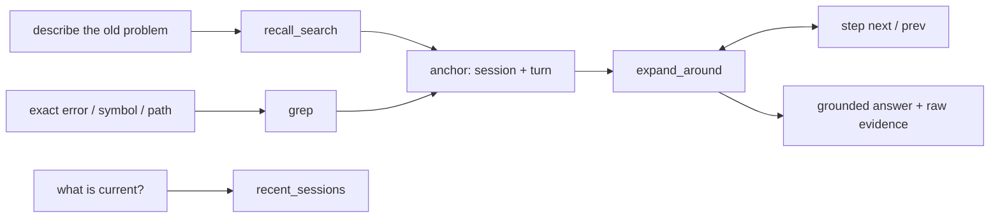
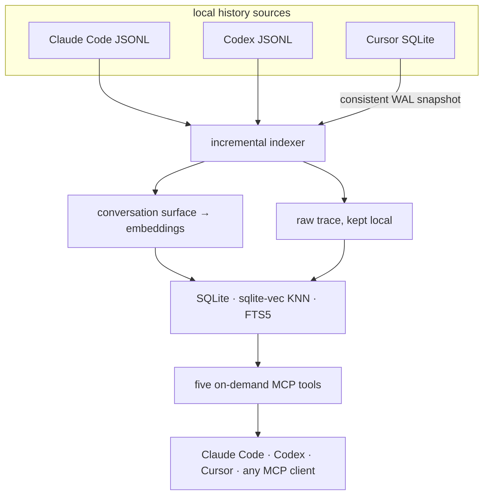

<div align="center">

<a href="#puesta-en-marcha-rápida">
  
</a>

<br />
<br />

<strong>Memoria semántica compartida para Claude Code, Codex y Cursor.</strong><br />
Encuentra una decisión antigua por su significado. Abre la evidencia en bruto. Continúa el trabajo.

<br />
<br />

[](LICENSE)
[](pyproject.toml)
[](src/session_recall/server.py)
[](https://github.com/AbsoluteMode/session-recall/actions/workflows/test.yml)

<br />

[English](README.md) · [Русский](docs/README.ru.md) · Español · [中文](README.zh-CN.md)

*La versión en inglés es la de referencia; las traducciones pueden quedar rezagadas.*

</div>

---

Tus agentes de código recuerdan el chat actual. Tu trabajo vive repartido en meses de chats:
sesiones retomadas, suscripciones en paralelo, worktrees, agentes distintos.

Session Recall convierte ese historial en un único índice local-first y lo sirve de vuelta a
través de cinco herramientas MCP bien acotadas. Una sesión recién abierta puede recuperar lo
que Codex resolvió ayer y lo que Claude Code rechazó hace tres meses — con enlaces a los
turnos reales, la salida de las herramientas y el razonamiento. No es un archivo de resumen
que alguien mantiene a mano: la conversación original sigue siendo la fuente de verdad.

> **tú:** estábamos arreglando el conflicto del token de autenticación entre los dos
> servicios — ¿en qué quedamos?
>
> **agente:** *(recall_search → expand_around)* Los dos servicios compartían una misma cuenta
> OAuth, y el proveedor rota los tokens de refresco por cuenta, así que cada refresco
> invalidaba la copia del otro. Rechazaste el parche del directorio de credenciales
> compartidas por demasiado acoplado, y optaste por un servicio keeper como dueño de la
> sesión. La especificación nunca llegó a escribirse — ese era el siguiente paso.

## Qué obtienes

| | Capacidad | Qué cambia |
|---|---|---|
| **Una sola memoria** | Claude Code, Codex y Cursor alimentan el mismo índice | Cambia de agente sin reiniciar la historia del proyecto |
| **Recuperación semántica** | Busca por significado, no solo por palabras exactas | Recupera decisiones que puedes describir pero no citar |
| **Navegación profunda** | Abre los turnos en bruto: llamadas a herramientas, salidas, razonamiento | Verifica la respuesta en lugar de fiarte de un resumen |
| **Degradación honesta** | Una caída de la parte semántica se comunica explícitamente | Un respaldo solo literal nunca se hace pasar por búsqueda semántica |
| **Local por defecto** | Incrustaciones ONNX incluidas y SQLite local | Empieza sin clave, sin servidor y sin cuenta |
| **Recall acotado** | Filtra por repo, origen o fechas del calendario local | Deja los proyectos ajenos fuera de la respuesta |
| **Respuestas de equipo** | Pregunta a la memoria local de un colega, con aprobación del dueño | Comparte contexto duramente ganado sin exponer sesiones en bruto |

## Dónde compensa

- **Arranque de sesión.** Una sesión nueva empieza ya en contexto — tanto si haces malabares
  con varias suscripciones, como si saltas entre agentes o vuelves a una tarea que
  «comentaste en algún momento».
- **Bugs y regresiones.** Antes de arreglar nada, el agente pregunta al historial: *¿se había
  visto ya este bug? ¿cómo se arregló? ¿por qué creímos que estaba arreglado?* Una recaída
  deja de parecer un bug nuevo — y la corrección pasa de ser un parche a ser una excavación
  en el componente.
- **Procedimientos.** Explica un flujo de trabajo una sola vez — cómo leer una traza, cómo
  desglosar el gasto de tokens por tarea — y cualquier sesión posterior lo repite sin que
  haya que guiarla de nuevo.
- **Causa y efecto.** Di «cambiemos esta decisión» y el agente busca el momento en que se
  tomó: *«elegimos X por compatibilidad con Y — antes de cambiar nada, asegúrate de que Y
  sobrevive»*.

## Cinco herramientas, un solo flujo de trabajo

La interfaz se mantiene deliberadamente pequeña:

| Herramienta MCP | Úsala cuando |
|---|---|
| `recall_search(query)` | Recuerdas la idea, no las palabras exactas |
| `expand_around(session_id, uuid)` | Encontraste un ancla y necesitas la evidencia que la rodea |
| `step(session_id, uuid, direction)` | Necesitas el turno en bruto adyacente sin otra búsqueda |
| `grep(pattern)` | Conoces un error, un símbolo, una ruta o un identificador exactos |
| `recent_sessions()` | Quieres el trabajo más fresco — y la frescura del índice |



Cada herramienta de descubrimiento acepta un `source` opcional (`claude` | `codex` | `cursor`),
un `scope_cwd` para acotar los resultados al repo actual (los worktrees colapsan a la raíz
del repo) y fechas del calendario local (`on_date`, o `start_date` / `end_date`, más un
`timezone` IANA). Las anclas clasificadas llevan su procedencia y una marca de tiempo
legible. `grep` escanea bajo demanda **todas** las transcripciones indexadas — incluidos los
turnos internos (salida de herramientas, razonamiento) que nunca se convirtieron en
fragmentos de búsqueda. Solo bajo demanda: sin inyección proactiva de contexto en cada prompt.

<details>
<summary><strong>Ver una llamada completa</strong></summary>

```json
{
  "query": "why did refresh tokens conflict?",
  "scope_cwd": "/work/keeper",
  "source": "codex",
  "start_date": "2026-05-01",
  "end_date": "2026-06-30",
  "timezone": "Europe/Moscow"
}
```

`recall_search` responde `{"anchors": [...], "degraded": null | "reason"}`. Cuando `degraded`
viene establecido, el proveedor de incrustaciones estaba inalcanzable y solo se ejecutó la
coincidencia literal — el agente puede decirlo en lugar de confundir un fallo léxico con un
historial vacío.

</details>

## Puesta en marcha rápida

Dos piezas: un CLI de Python (que también incluye el servidor MCP) y un plugin que lo conecta
a tu agente. Calcula unos dos minutos más la primera ejecución del índice.

### 1. Instala el CLI y construye el índice

```bash
pipx install git+https://github.com/AbsoluteMode/session-recall
session-recall setup   # one question (interaction language), then the first index
```

No hace falta clave: sin nada configurado, la indexación corre sobre un modelo de CPU
incluido, descargado una vez y elegido según tu idioma de interacción. La primera ejecución
recorre todo tu historial — minutos para meses de transcripciones, segundos a partir de
entonces. Instalaciones con script: `session-recall setup --lang en --yes`.

```console
$ session-recall index
indexed 2175 chunks from changed transcripts

your history: 1053 sessions spanning 168 days, 40,037 searchable fragments
  Claude Code 372 · Codex 680 · Cursor 1
  busiest: sidekey, trend_detection, glitch
```

Las incrustaciones alojadas de Voyage clasifican notablemente mejor que el modelo incluido;
para usarlas, exporta `VOYAGE_API_KEY` antes de indexar — consulta
[Proveedores de incrustaciones](#proveedores-de-incrustaciones).

### 2. Conecta tus agentes

`pipx` coloca `session-recall` y `session-recall-mcp` en `~/.local/bin` — exactamente donde
los manifiestos de los plugins los buscan.

<details open>
<summary><strong>Claude Code</strong></summary>

```text
/plugin marketplace add AbsoluteMode/session-recall
/plugin install session-recall
```

Después inicia una sesión nueva — los servidores MCP, las skills y el hook SessionStart se
cargan al arrancar la sesión, no al instalar. ¿Prefieres que el agente remate el trabajo?
Dile `set up session-recall` (o ejecuta `/session-recall:setup`): hace las preguntas de la
configuración inicial en el chat, ejecuta los comandos por sí mismo y termina con una
comprobación de salud y una búsqueda real sobre tu historial.

</details>

<details>
<summary><strong>Codex</strong></summary>

El repositorio incluye un [`.codex-plugin/plugin.json`](.codex-plugin/plugin.json) nativo —
listo para soltarlo en un repo local o en tu marketplace personal; consulta la
[guía de instalación local de plugins](https://learn.chatgpt.com/docs/build-plugins#install-a-local-plugin-manually).
Codex también te pide revisar una vez los hooks recién instalados mediante `/hooks`.

</details>

<details>
<summary><strong>Cursor</strong></summary>

Requiere Cursor 2.5+ (ahí se introdujeron los plugins). Añade el repositorio como
marketplace:

```bash
cursor-agent plugin marketplace add https://github.com/AbsoluteMode/session-recall.git
```

Después escribe `/add-plugin session-recall` en Cursor Agent y aprueba una sola vez el
servidor MCP stdio local, para que las herramientas puedan arrancar. Para desarrollar el
plugin, lanza `cursor-agent --plugin-dir /absolute/path/to/session-recall` en lugar de
instalar una copia cacheada.

Cursor se detecta automáticamente en su ruta de datos habitual de macOS/Linux y no necesita
estar en ejecución. ¿Perfil portátil o personalizado? Apunta directamente a la base de datos
con `SESSION_RECALL_CURSOR_DB=/path/to/User/globalStorage/state.vscdb`.

</details>

### 3. Comprueba que funciona

```bash
session-recall search "something you actually discussed last week"
```

Los resultados con `score` significan que la búsqueda semántica está viva. En el agente,
`claude mcp list` debería mostrar `session-recall ✔ Connected`, y preguntar por trabajo
pasado debería disparar `recall_search`. No hay nada más que configurar: cada plugin incluye
el hook de arranque de su host y reindexa en segundo plano, de modo que el índice compartido
se mantiene al día con los tres historiales por sí solo.

## Cómo funciona



Solo se incrusta la «superficie» de la conversación — los prompts del usuario y las
respuestas de texto del asistente. Las llamadas a herramientas, los resultados, el
razonamiento y demás datos de traza nunca se envían a un proveedor de incrustaciones, pero
siguen accesibles bajo demanda mediante `expand_around`, `step` y `grep`. Las sidechains de
Claude y las sesiones de subagentes lanzados se omiten a propósito: son maquinaria interna,
no la conversación.

Cursor se lee desde su almacén SQLite con la API de backup en línea, de modo que una base de
datos WAL viva se captura de forma consistente sin bloquear el editor. Sus burbujas se
normalizan en instantáneas JSONL duraderas y direccionadas por contenido dentro del
directorio de datos — la navegación profunda sigue funcionando después de que Cursor se
cierre, se actualice o se desinstale.

La indexación es incremental y barata sobre transcripciones vivas: son de solo añadir
(append-only), así que los fragmentos sin cambios se emparejan por hash de contenido y sus
vectores se reutilizan — solo los turnos nuevos llegan al proveedor de incrustaciones. Mover
un rollout de Codex al archivo también reutiliza sus vectores. Cada archivo se indexa en su
propia transacción; un archivo que falla se registra y se reintenta en la siguiente
ejecución, sin abortar nunca el resto.

## Referencia rápida del CLI

```bash
# Refresh every history, or one source
session-recall index
session-recall index --source cursor

# Semantic search — unified by default, scopable to a repo
session-recall search "why did we choose the keeper service?"
session-recall search "deployment work" --source codex --scope /work/keeper

# Local calendar dates, any IANA timezone (defaults to this computer's)
session-recall recent --date 2026-07-14
session-recall search "deployment work" \
  --start-date 2026-07-14 --end-date 2026-07-16 \
  --timezone Asia/Yekaterinburg

# Exact raw scan — no embedding call, caps at 100 matches by default
session-recall grep "invalid_grant" --limit 100

# Housekeeping
session-recall prune    # drop rows for transcripts deleted from disk
session-recall health   # the whole chain, verdict GREEN/AMBER/RED
```

`search`, `recent`, `grep` y `prune` aceptan `--source claude|codex|cursor`; omítelo para el
historial unificado. Los filtros de fecha son inclusivos y puede omitirse cualquiera de los
dos límites.

## Proveedores de incrustaciones

Nada está atado a un solo proveedor. `SESSION_RECALL_EMBED=<preset>` establece punto de
conexión, modelo, dimensión y reranker a la vez, porque esas cuatro no son elecciones
independientes:

| Preset | Ejecución | Modelo | Dim | Reranker |
|---|---|---|---:|---|
| `builtin-en` | **incluido, gratis** | `bge-small-en-v1.5` | 384 | — |
| `builtin-zh` | **incluido, gratis** | `bge-small-zh-v1.5` | 512 | — |
| `builtin-multi` | **incluido, gratis** | `paraphrase-multilingual-MiniLM-L12-v2` | 384 | — |
| `ollama` | **local, gratis** | `nomic-embed-text` | 768 | — |
| `lmstudio` | **local, gratis** | `nomic-embed-text-v1.5` | 768 | — |
| `voyage` | alojado, requiere clave | `voyage-4-large` | 1024 | `rerank-2.5` |
| `openai` | alojado, requiere clave | `text-embedding-3-large` | 1024 | — |

Sin ningún preset configurado, Session Recall elige Voyage cuando `VOYAGE_API_KEY` está
presente, después sondea si ya hay un servidor local escuchando y, si no, ejecuta el modelo
ONNX incluido — lo de serie siempre funciona. La variante incluida sigue el idioma de
interacción que elegiste en la configuración inicial (`SESSION_RECALL_LANG=en|zh|…`: un
pequeño especialista en inglés o en chino, multilingüe en el resto de casos). El primer uso
descarga el modelo una vez al directorio de datos (70–240 MB); desde entonces, inferencia en
CPU. La clasificación es notablemente más gruesa que la de Voyage alojado — un punto de
partida, no el techo. Los presets locales no incluyen reranker, así que la clasificación es
solo KNN + FTS.

**Gratis y local, de principio a fin:**

```bash
ollama pull nomic-embed-text
export SESSION_RECALL_EMBED=ollama
session-recall index
```

**Tu propio punto de conexión** — cualquier servidor que hable `/v1/embeddings` (llama.cpp,
vLLM, una puerta de enlace corporativa). Las variables individuales siempre ganan al preset,
así que mezcla con libertad:

```bash
export SESSION_RECALL_EMBED_PROVIDER=openai-compatible
export SESSION_RECALL_EMBED_BASE_URL=https://embeddings.internal/v1
export SESSION_RECALL_EMBED_MODEL=your-model
export SESSION_RECALL_EMBED_DIM=1024
```

**Un embedder distinto necesita su propio índice.** Las tablas vectoriales son de ancho
fijo, así que cambiar el modelo o la dimensión implica reconstruir: borra
`~/.local/share/session-recall/index.db` y vuelve a ejecutar `index`. Session Recall toma la
huella del espacio de incrustaciones de cada archivo indexado y se niega a mezclar espacios —
la búsqueda semántica se apaga con un mensaje explícito en lugar de devolver clasificaciones
engañosas.

<details>
<summary><strong>Notas sobre licencias de modelos</strong></summary>

`nomic-embed-text` es el predeterminado local porque es Apache-2.0 y se instala con un solo
comando. Existen modelos pequeños más fuertes — `jina-embeddings-v5-text-nano` puntúa
muchísimo mejor para su tamaño — pero son **CC BY-NC**, algo que cualquiera que indexe
historial de trabajo estaría violando sin que nadie se lo dijera. Si tu uso es genuinamente
no comercial, apunta las variables de arriba a uno de ellos. Si trabajas en más idiomas que
el inglés, `qwen3-embedding:0.6b` (Apache-2.0) maneja el historial multilingüe bastante
mejor que `nomic`.

</details>

## Mantener el índice actualizado

Si instalaste un plugin, esto ya está resuelto: el hook `SessionStart` incluido ejecuta
`session-recall index` en segundo plano en cada arranque de sesión, y la indexación
incremental lo mantiene barato.

<details>
<summary><strong>¿Registraste el servidor MCP a mano? Añade el hook tú mismo</strong></summary>

En `~/.claude/settings.json`:

```json
"hooks": {
  "SessionStart": [
    { "hooks": [ {
      "type": "command",
      "command": "sr=/abs/path/.venv/bin/session-recall; pgrep -f \"$sr index\" >/dev/null 2>&1 || (VOYAGE_API_KEY=... \"$sr\" index >/tmp/sr-index.log 2>&1 &)"
    } ] }
  ]
}
```

La guarda `pgrep` evita ejecuciones solapadas; `( … & )` se desacopla para que el arranque de
sesión no espere. Mantén síncrono el hook a nivel de host — el shell ya manda el indexador a
segundo plano, y Codex ignora la extensión `async` de Claude. Un temporizador `launchd`/cron
también sirve.

</details>

## Modo equipo — pregunta al historial de un colega

El mismo recall, entre máquinas: emparéjate una vez con un colega y tu agente podrá
preguntarle al suyo por su trabajo pasado.

> **tú → el agente de un colega:** cuando te topaste con el problema del arranque en local
> de X — ¿cómo lo resolviste?
>
> **su agente** *(después de que el colega apruebe la respuesta)*: fija la configuración en
> …, luego …, y el problema no vuelve a aparecer.

Lo que antes era un hilo de Slack y una explicación recordada a medias se convierte en una
pregunta y una respuesta fundamentada. Nunca ves el historial en bruto del colega — solo la
respuesta que aprobó.

Aquí la privacidad es mecánica, no política:

- las preguntas y las respuestas viajan como **sobres cifrados de extremo a extremo**; el
  relay almacena blobs ciegos que no puede leer;
- las respuestas las construye un **worker aislado de solo lectura**, acotado a los proyectos
  concedidos explícitamente a ese contacto (`share allow`);
- cada respuesta candidata pasa por un **escáner de secretos** y después por la **aprobación
  explícita del dueño** (bot de Telegram, o `share approve` en local) antes de salir de la
  máquina;
- un contacto puede pausarse en cualquier momento (`share pause`) y un peer puede revocarse
  (`share revoke`).

Buscar en el índice de un peer no exige configurar incrustaciones de tu lado: la consulta
viaja como texto, y el worker del dueño la incrusta con su propio proveedor contra su propio
índice.

<details>
<summary><strong>Elige un transporte (una vez, antes del emparejamiento)</strong></summary>

Una instalación recién hecha **no tiene transporte** y nunca habla con un servidor que no
hayas elegido. El relay es ciego — todo lo que transporta se sella y se firma en los
clientes — así que cuál usar es coordinación entre peers, no una cuestión de confianza.

**Carpeta compartida — cero infraestructura.** Dos cuentas en una misma máquina, o cualquier
carpeta que ambos peers sincronicen (Syncthing, Dropbox, un montaje NFS):

```bash
export SESSION_RECALL_SHARE_TRANSPORT_DIR=~/Sync/sr-share   # both peers, same folder
```

**Tu relay en la LAN.** Una máquina lo ejecuta y todos apuntan a ella. Los sobres van
cifrados de extremo a extremo en cualquier caso, pero esto es HTTP plano — resérvalo para
una red en la que confíes:

```bash
session-recall share relay --port 8787 --host 0.0.0.0       # on the relay machine
export SESSION_RECALL_RELAY_URL=http://192.168.1.20:8787    # on every peer
```

**Tu relay en internet.** El relay se liga a localhost a propósito y espera un terminador
TLS delante (Caddy es la opción de dos líneas):

```bash
session-recall share relay --port 8787    # binds 127.0.0.1
```

```text
relay.example.com {
    reverse_proxy 127.0.0.1:8787
}
```

Después, en cada peer: `export SESSION_RECALL_RELAY_URL=https://relay.example.com`. El relay
solo almacena blobs sellados, y cada buzón se vacía al recogerlo.
`SESSION_RECALL_RELAY_URL=none` mantiene una instalación en silencio de red a propósito. Pon
el `export` en tu perfil de shell para que los agentes y los temporizadores también lo vean.

</details>

<details>
<summary><strong>Emparejar y preguntar</strong></summary>

El emparejamiento es una ceremonia de una sola vez con una breve verificación SAS; después,
preguntar es un solo comando:

```bash
session-recall share init            # once per device, both sides
session-recall share invite          # you: prints a one-time code
session-recall share join <code>     # colleague: accepts it
session-recall share complete        # you: finish the handshake
session-recall share trust <name>    # both: confirm the SAS matched, name the peer
session-recall share allow <name> <project>
session-recall share notify          # owner side: worker + approval loop

session-recall share ask <name> "how did you fix the local X launch?"
session-recall share fetch           # collect the answers
```

</details>

## Meta docs — la memoria del proyecto, puesta por escrito

El recall en bruto responde a *qué se dijo*. Meta docs responde a lo que los agentes
preguntan de verdad en mitad de una tarea: *¿este bug ya se arregló antes? ¿cómo realizo
esta acción? ¿por qué se decidió así?* Un trabajo diario entrega el diálogo de cada sesión —
mensajes del usuario y respuestas finales, nunca el ruido de las herramientas — a un agente
destilador que mantiene entradas en Markdown dentro de un repositorio Git que tú eliges:

- `<project>/bugs/` — bugs que de verdad se arreglaron: cómo se reconoció, diagnosticó,
  arregló y demostró arreglado cada uno;
- `<project>/actions/` — procedimientos, paso a paso, escritos para que un agente al que se
  le pregunte de nuevo pueda seguir la entrada por sí solo;
- `<project>/decisions/` — decisiones disputadas: qué se decidió, por qué así, qué se
  rechazó;
- `USER/` — un mapa global de dónde vive tu información y *cómo encontrarla* (comandos de
  consulta y ubicaciones de almacenamiento — nunca los valores almacenados en sí).

```bash
session-recall metadocs init ~/meta-docs --from-today   # memory starts now
session-recall metadocs run                             # one pass now
session-recall metadocs enable   # daily job: launchd (macOS) / systemd user timer (Linux)
session-recall metadocs status
session-recall metadocs index-history --days 30         # opt-in: distill the past, once
```

Todo el mundo del destilador son cuatro verbos MCP — `search / create / edit / delete` — y
las reglas que soportan la carga son mecánica del servidor, no peticiones en el prompt:
`create` se rechaza hasta que el agente haya hecho `search` (la deduplicación es
obligatoria), las entradas se escanean en busca de secretos antes de que un solo byte llegue
al disco, y `delete` exige un motivo. Las ejecuciones son incrementales y cada proyecto con
cambios recibe su propio commit local — revisar es un diff, deshacer es un revert, y
compartir la memoria con un equipo es simplemente subir el repo a algún lugar privado. Nada
se sube a menos que actives `--push`; el motor y el modelo salen solo de la configuración
(`init --engine claude-cli|codex --model …`) — nada se elige en silencio.

## La privacidad es una invariante estricta

Este es un repositorio público. **En él solo entra código.** Los datos de ejecución viven
bajo `~/.local/share/session-recall/`, fuera del árbol del repo — físicamente no pueden
acabar en un commit.

| Se queda en tu máquina | Sale solo cuando tú lo decides |
|---|---|
| Las transcripciones originales de Claude Code y Codex | El texto de superficie de la conversación → el embedder alojado que configures |
| El almacén SQLite de Cursor y sus instantáneas normalizadas | Una respuesta del modo equipo aprobada explícitamente |
| Llamadas a herramientas, salidas, razonamiento — toda la traza en bruto | Nada, en la ruta de incrustación incluida/local |
| El índice SQLite y los vectores almacenados | |

- Las claves de API son solo variables de entorno; `.gitignore` bloquea `.env`.
- Las pruebas usan fixtures sintéticos, nunca un trozo real de una sesión.
- El proveedor incluido mantiene toda la ruta de indexación en el dispositivo. Si eliges un
  proveedor alojado, elige uno al que confiarías el texto de superficie de tus
  transcripciones.

## Solución de problemas

Empieza aquí — comprueba toda la cadena y sale con código distinto de cero cuando algo está
roto de verdad, así que también funciona desde un temporizador:

```console
$ session-recall health
[ok  ] Freshness  2 minutes behind
[warn] Embedder   responded in 5828 ms
                  → slow provider will make indexing crawl
[ok  ] Vector space  builtin/BAAI/bge-small-en-v1.5/384
[ok  ] Corpus     1054 sessions (claude 373, codex 680, cursor 1)
[ok  ] Sources    claude, codex, cursor present

verdict: AMBER (voyage/voyage-4-large, index at ~/.local/share/session-recall/index.db)
```

La frescura compara la transcripción más nueva en disco con el turno más nuevo del índice,
así que un indexador que se ejecuta en cada sesión y falla todas las veces sigue apareciendo
retrasado — exactamente el fallo que de otro modo resulta invisible.

| Síntoma | Causa / siguiente paso |
|---|---|
| `recall_search` responde con `degraded` establecido | El proveedor de incrustaciones está inalcanzable — solo se ejecutó la coincidencia literal. Los resultados son reales, pero un fallo no demuestra nada. |
| `degraded` dice "embedder changed" | El índice se construyó en otro espacio de incrustaciones. Ejecuta `session-recall index` para reincrustar; hasta entonces la clasificación semántica queda apagada, a propósito. |
| El indexador registra `HTTP code 403` con un cuerpo HTML | No es tu clave: un WAF está bloqueando tu IP (habitual en salidas de VPN y de centros de datos). El mismo 403 aparece incluso sin clave. Enruta la salida por otro lado o cambia de proveedor. |
| `Missing dependencies for SOCKS support` | Hay un proxy SOCKS configurado en el entorno, pero `PySocks` no está instalado en ese venv. |
| `recent_sessions` muestra una marca de tiempo antigua | El indexador no ha terminado bien últimamente. Ejecuta `session-recall index` a mano y lee la salida. |
| Cursor vive en un perfil personalizado | Define `SESSION_RECALL_CURSOR_DB=/path/to/User/globalStorage/state.vscdb`. |

## Desarrollo

```bash
git clone https://github.com/AbsoluteMode/session-recall.git
cd session-recall
python -m venv .venv
.venv/bin/pip install -e ".[dev]"
.venv/bin/pytest -q
```

Para registrar el servidor MCP a mano en lugar de usar el plugin:

```bash
claude mcp add session-recall --scope user -- /absolute/path/.venv/bin/session-recall-mcp
```

La justificación de ingeniería y las invariantes viven en [`docs/decisions/`](docs/decisions/).
Empieza por:

- [Índice unificado de Claude Code + Codex](docs/decisions/2026-07-10-unified-claude-codex-index.md)
- [Cursor como origen en bruto duradero](docs/decisions/2026-08-03-cursor-durable-raw-source.md)
- [Recall acotado por proyecto](docs/decisions/2026-06-26-recall-project-scope.md)
- [Puerta de seguridad de la compartición P2P](docs/decisions/2026-07-30-p2p-sharing-v1-security-gate.md)
- [Meta docs, memoria viva del proyecto](docs/decisions/2026-07-31-metadocs-living-project-memory.md)

## Hoja de ruta

- **Índice alojado/de equipo** — un índice compartido para todo el equipo en lugar de copias
  por máquina. La pregunta abierta honesta: quien busca debe incrustar la consulta, así que
  un espacio vectorial compartido implica una ruta de incrustación compartida.
- **Omitir la aprobación por contacto** — saltarse la aprobación por respuesta con los peers
  en los que confías plenamente; hoy cada respuesta se aprueba explícitamente.
- **Más historiales** — transcripciones de otros agentes más allá de Claude Code, Codex y
  Cursor.

## Contribuir

Los issues, las mejoras de documentación, los adaptadores de hosts y las traducciones son
bienvenidos. Mantén los fixtures sintéticos y nunca incluyas en un commit transcripciones
reales, índices, incrustaciones ni credenciales.

<div align="center">
  <br />
  <strong>Deja de reconstruir el contexto. Continúalo.</strong>
  <br />
  <br />
  <a href="#puesta-en-marcha-rápida">Empieza ahora</a>
  &nbsp;·&nbsp;
  <a href="LICENSE">Licencia MIT</a>
</div>
