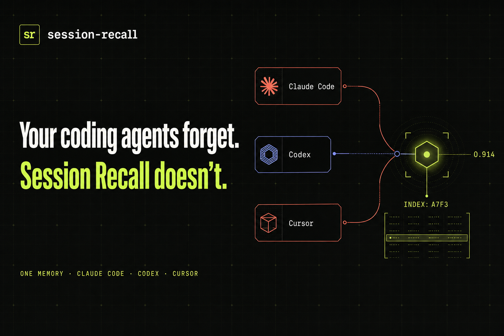
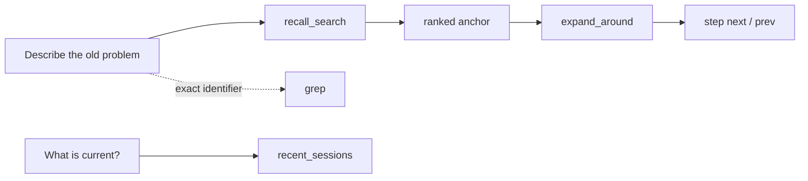
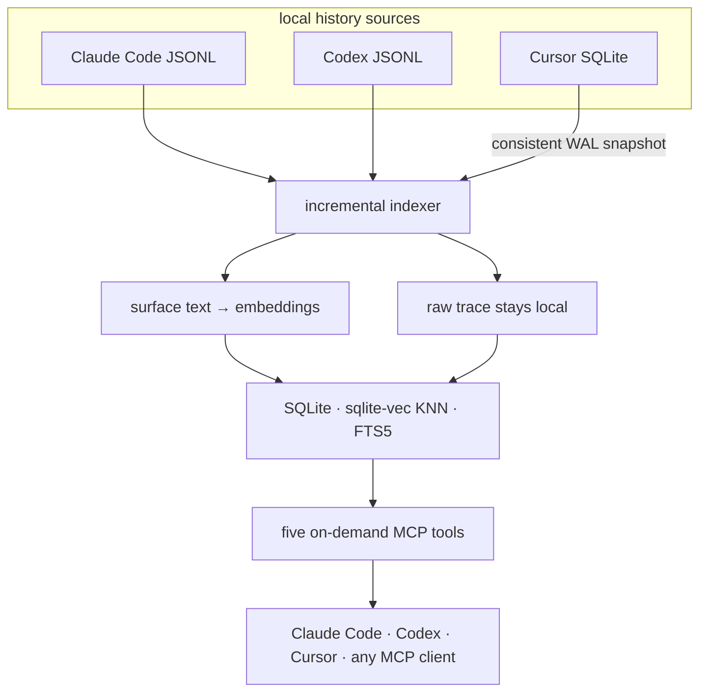

<div align="center">
  <a href="#quick-start">
    
  </a>

  <br />
  <br />

  <strong>Shared semantic memory for Claude Code, Codex, and Cursor.</strong><br />
  Find an old decision by meaning. Open the raw evidence. Continue the work.

  <br />
  <br />

  [](LICENSE)
  [](pyproject.toml)
  [](src/session_recall/server.py)
  [](https://github.com/AbsoluteMode/session-recall/actions/workflows/test.yml)
  [](https://github.com/AbsoluteMode/session-recall/stargazers)

  <br />

  [English](README.md) · [Русский](docs/README.ru.md) · [Español](README.es-ES.md) <sup>community translation</sup>
</div>

---

Your coding agents remember the current chat. Your work lives across months of chats,
resumed sessions, subscriptions, worktrees, and different agents.

Session Recall turns that history into one local-first index and exposes five focused MCP
tools. A fresh Cursor session can recover what Codex discovered yesterday and what Claude
Code rejected three months ago — with links back to the actual turns, tool output, and
reasoning.

```text
you       we were fixing the auth-token conflict — where did we land?

agent     [recall_search → expand_around]
          Both services shared one OAuth account. The provider rotates refresh
          tokens per account, so each refresh invalidated the other service's copy.
          You rejected a shared credentials directory as too coupled and chose one
          keeper service to own the session. The missing spec was the next step.
```

> No summary file to maintain. No context dump injected into every prompt. The original
> conversation remains the source of truth.

## What you get

| | Capability | What it changes |
|---|---|---|
| **One memory** | Claude Code, Codex, and Cursor feed the same index | Switch agents without resetting the project story |
| **Semantic retrieval** | Search by meaning, not only exact words | Recover decisions you can describe but cannot quote |
| **Deep navigation** | Open raw turns, tool calls, outputs, and reasoning | Verify the answer instead of trusting a generated summary |
| **Honest degradation** | A semantic outage is reported explicitly | Literal fallback never pretends to be semantic search |
| **Local by default** | Bundled ONNX embeddings and local SQLite | Start without a key, server, or account |
| **Scoped recall** | Filter by repo, source, or local calendar dates | Keep unrelated projects out of the answer |

### Where it pays off

- **Resume old work.** Recover the decision, rejected alternatives, and unfinished next step.
- **Catch regressions.** Ask whether a bug happened before, how it was fixed, and why the
  previous fix looked correct.
- **Cross agent boundaries.** Let Cursor continue what Codex discovered and Claude Code
  validated.
- **Replay procedures.** Explain an operational workflow once; retrieve its grounded steps
  later.

## Five tools, one retrieval workflow

Session Recall keeps the interface deliberately small:

| MCP tool | Use it when |
|---|---|
| `recall_search(query)` | You remember the idea, not the wording |
| `expand_around(session_id, uuid)` | You found an anchor and need the surrounding evidence |
| `step(session_id, uuid, direction)` | You need the next or previous raw turn without another search |
| `grep(pattern)` | You know an exact error, symbol, path, or identifier |
| `recent_sessions()` | You want the freshest work and effective index freshness |



Every discovery tool can narrow by `source=claude|codex|cursor`, project scope, and local
calendar date. Ranked anchors include provenance and a human-readable timestamp.

<details>
<summary><strong>See a complete agent call</strong></summary>

```json
{
  "query": "why did refresh tokens conflict?",
  "scope_cwd": "/work/keeper",
  "source": "codex",
  "start_date": "2026-05-01",
  "end_date": "2026-06-30",
  "timezone": "Europe/Moscow"
}
```

`recall_search` returns `{"anchors": [...], "degraded": null | "reason"}`. When
`degraded` is set, only literal matching ran; a miss is inconclusive and the agent can say so.

</details>

## Quick start

Install the CLI, choose an interaction language, and build the first index:

```bash
pipx install git+https://github.com/AbsoluteMode/session-recall
session-recall setup
```

No key is required. Session Recall downloads a small bundled embedding model once and runs it
locally on CPU. Later indexing is incremental.

Then connect the agents you use.

<details open>
<summary><strong>Claude Code</strong></summary>

```text
/plugin marketplace add AbsoluteMode/session-recall
/plugin install session-recall
```

Start a new session so the MCP server, skill, and SessionStart hook load. You can also say
`set up session-recall` or run `/session-recall:setup` and let the agent complete onboarding.

</details>

<details>
<summary><strong>Cursor</strong></summary>

```bash
cursor-agent plugin marketplace add https://github.com/AbsoluteMode/session-recall.git
```

Then run `/add-plugin session-recall` in Cursor Agent and approve the local MCP server once.
For plugin development, launch:

```bash
cursor-agent --plugin-dir /absolute/path/to/session-recall
```

</details>

<details>
<summary><strong>Codex</strong></summary>

The repository ships a native [`.codex-plugin/plugin.json`](.codex-plugin/plugin.json). Install
it through the [Codex local plugin flow](https://learn.chatgpt.com/docs/build-plugins#install-a-local-plugin-manually),
then review the bundled SessionStart hook once with `/hooks`.

</details>

Verify the complete chain:

```bash
session-recall health
session-recall search "something you actually discussed last week"
```

## How it works



Only user prompts and assistant text replies are embedded. Tool calls, results, reasoning, and
other trace data remain reachable through raw expansion and grep but are not sent to an
embedding provider.

Cursor is read from its local SQLite store with the online backup API, so a live WAL database
is captured consistently without blocking the editor. Its bubbles are normalized into durable,
content-addressed local JSONL snapshots; deep navigation continues to work after Cursor closes,
upgrades, or is removed.

Indexing is incremental and transaction-scoped per transcript. Unchanged chunks reuse vectors.
A corrupt or newly incompatible source does not destroy the last good snapshot, and one failing
source does not undo successful work from the others.

## CLI examples

```bash
# Refresh every history, or one source
session-recall index
session-recall index --source cursor

# Semantic search
session-recall search "why did we choose the keeper service?"
session-recall search "deployment work" --source codex --scope /work/keeper

# Local calendar dates and timezone
session-recall recent --date 2026-07-14
session-recall search "deployment work" \
  --start-date 2026-07-14 --end-date 2026-07-16 \
  --timezone Asia/Yekaterinburg

# Exact raw scan — no embedding call
session-recall grep "invalid_grant" --limit 100

# Remove rows for transcripts deleted from disk
session-recall prune
```

## Embedding providers

The zero-config route is bundled and local. Presets keep endpoint, model, dimension, and
reranker coherent:

| Preset | Runs | Model | Dim | Reranker |
|---|---|---|---:|---|
| `builtin-en` | local, free | `bge-small-en-v1.5` | 384 | — |
| `builtin-zh` | local, free | `bge-small-zh-v1.5` | 512 | — |
| `builtin-multi` | local, free | `paraphrase-multilingual-MiniLM-L12-v2` | 384 | — |
| `ollama` | local, free | `nomic-embed-text` | 768 | — |
| `lmstudio` | local, free | `nomic-embed-text-v1.5` | 768 | — |
| `voyage` | hosted, key | `voyage-4-large` | 1024 | `rerank-2.5` |
| `openai` | hosted, key | `text-embedding-3-large` | 1024 | — |

```bash
# Fully local with an existing Ollama install
ollama pull nomic-embed-text
export SESSION_RECALL_EMBED=ollama
session-recall index
```

Any `/v1/embeddings`-compatible endpoint also works:

```bash
export SESSION_RECALL_EMBED_PROVIDER=openai-compatible
export SESSION_RECALL_EMBED_BASE_URL=https://embeddings.internal/v1
export SESSION_RECALL_EMBED_MODEL=your-model
export SESSION_RECALL_EMBED_DIM=1024
```

Changing embedding space requires re-indexing. Session Recall fingerprints every indexed file
and disables semantic search while spaces are mixed instead of returning misleading rankings.

## Privacy is a hard invariant

| Stays local | Can leave the machine only when you choose it |
|---|---|
| Original Claude Code and Codex transcripts | User/assistant surface text sent to a configured hosted embedder |
| Cursor's SQLite store and normalized snapshots | An explicitly approved team-mode answer |
| Tool calls, outputs, and reasoning | Nothing, with the bundled/local embedding path |
| SQLite index and stored vectors | |

- Runtime data lives under the user data directory, outside the repository tree.
- Keys are environment variables; `.env` is ignored.
- Tests use synthetic fixtures, never real session slices.
- The bundled provider keeps the entire indexing path on-device.
- Hosted providers are optional; choose one you trust with conversation surface text.

## Team mode

Pair with a colleague once, then let your agent ask their agent about past work. You receive only
the answer they approve — never their raw history.

The mechanics are explicit: end-to-end encrypted envelopes, a blind relay or shared-folder
transport, a project-scoped read-only worker, secret scanning, and owner approval before an
answer leaves the machine.

<details>
<summary><strong>Pairing and asking</strong></summary>

```bash
session-recall share init
session-recall share invite
session-recall share join <code>
session-recall share complete
session-recall share trust <name>
session-recall share allow <name> <project>
session-recall share notify

session-recall share ask <name> "how did you fix the local launch?"
session-recall share fetch
```

Choose the transport explicitly with either a shared directory or your own relay. A fresh install
has no sharing transport and sends nothing anywhere.

</details>

## Meta docs

Raw recall answers *what was said*. Meta docs turns confirmed bugs, procedures, and decisions
into durable Markdown maintained by a distiller agent in a Git repository you choose.

```bash
session-recall metadocs init ~/meta-docs --from-today
session-recall metadocs run
session-recall metadocs enable
session-recall metadocs status
```

Runs are incremental. Each changed project receives its own local commit. Nothing is pushed
unless you explicitly opt in.

## Troubleshooting

Start with the command that checks freshness, the embedder, vector-space consistency, corpus,
and source paths:

```console
$ session-recall health
[ok  ] Freshness     up to date
[ok  ] Embedder      responded in 42 ms
[ok  ] Vector space  builtin/BAAI/bge-small-en-v1.5/384
[ok  ] Corpus        1054 sessions (claude 373, codex 680, cursor 1)
[ok  ] Sources       claude, codex, cursor present

verdict: GREEN
```

| Symptom | Meaning / next step |
|---|---|
| `recall_search` returns `degraded` | Semantic retrieval is unavailable; only literal matching ran. A miss proves nothing. |
| `degraded` says the embedder changed | Run `session-recall index` for every source to rebuild one coherent vector space. |
| `HTTP code 403` with an HTML body | Usually provider WAF/network egress, not the API key. Switch route or provider. |
| `recent_sessions` is stale | Run `session-recall index` manually and read the source-specific error. |
| Cursor lives in a custom profile | Set `SESSION_RECALL_CURSOR_DB=/path/to/User/globalStorage/state.vscdb`. |

## Development

```bash
git clone https://github.com/AbsoluteMode/session-recall.git
cd session-recall
python -m venv .venv
.venv/bin/pip install -e ".[dev]"
.venv/bin/pytest -q
```

The MCP server can be registered by hand during development:

```bash
claude mcp add session-recall --scope user -- /absolute/path/.venv/bin/session-recall-mcp
```

Engineering rationale and invariants live in [`docs/decisions/`](docs/decisions/). Start with:

- [Unified Claude Code + Codex index](docs/decisions/2026-07-10-unified-claude-codex-index.md)
- [Cursor as a durable raw source](docs/decisions/2026-08-03-cursor-durable-raw-source.md)
- [Project-scoped recall](docs/decisions/2026-06-26-recall-project-scope.md)
- [P2P sharing security gate](docs/decisions/2026-07-30-p2p-sharing-v1-security-gate.md)
- [Meta docs living project memory](docs/decisions/2026-07-31-metadocs-living-project-memory.md)

## Roadmap

- A hosted/team index with an explicit shared embedding path.
- Approval bypass for individually trusted contacts.
- More agent-history adapters beyond Claude Code, Codex, and Cursor.

## Contributing

Issues, documentation improvements, host adapters, and language translations are welcome.
Keep fixtures synthetic and never commit real transcripts, indexes, embeddings, or credentials.

<div align="center">
  <br />
  <strong>Stop rebuilding context. Continue it.</strong>
  <br />
  <br />
  <a href="https://github.com/AbsoluteMode/session-recall">GitHub</a>
  &nbsp;·&nbsp;
  <a href="LICENSE">MIT License</a>
</div>
