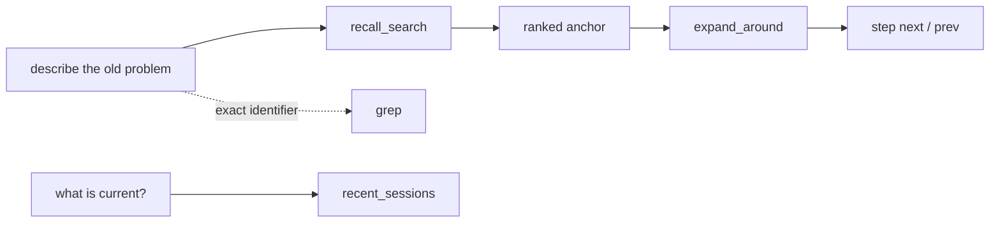
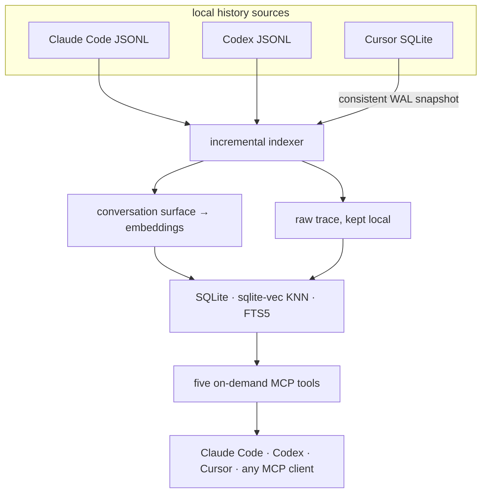

<div align="center">

<a href="#quick-start">
  
</a>

<br />
<br />

<strong>Shared semantic memory for Claude Code, Codex, and Cursor.</strong><br />
Find an old decision by meaning. Open the raw evidence. Continue the work.

<br />
<br />

[](LICENSE)
[](pyproject.toml)
[](src/session_recall/server.py)
[](https://github.com/AbsoluteMode/session-recall/actions/workflows/test.yml)

<br />

English · [Русский](docs/README.ru.md) · [Español](README.es-ES.md) · [中文](README.zh-CN.md)

</div>

---

Your coding agents remember the current chat. Your work lives across months of chats —
resumed sessions, parallel subscriptions, worktrees, different agents.

Session Recall turns that history into one local-first index and serves it back through
five focused MCP tools. A fresh session can recover what Codex worked out yesterday and
what Claude Code rejected three months ago — with links back to the actual turns, tool
output, and reasoning. Not a summary file someone maintains by hand: the original
conversation stays the source of truth.

> **you:** we were fixing the auth token conflict between the two services — where did we land?
>
> **agent:** *(recall_search → expand_around)* Both services shared one OAuth account, and the
> provider rotates refresh tokens per account, so each refresh invalidated the other's copy. You
> rejected the shared-credentials-directory patch as too coupled, and settled on a keeper service
> owning the session. The spec was never written — that was the next step.

## What you get

| | Capability | What it changes |
|---|---|---|
| **One memory** | Claude Code, Codex, and Cursor feed the same index | Switch agents without resetting the project story |
| **Semantic retrieval** | Search by meaning, not only exact words | Recover decisions you can describe but cannot quote |
| **Deep navigation** | Open raw turns: tool calls, outputs, reasoning | Verify the answer instead of trusting a summary |
| **Honest degradation** | A semantic outage is reported explicitly | A literal-only fallback never poses as semantic search |
| **Local by default** | Bundled ONNX embeddings and local SQLite | Start without a key, a server, or an account |
| **Scoped recall** | Filter by repo, source, or local calendar dates | Keep unrelated projects out of the answer |
| **Team answers** | Ask a colleague's local memory, owner-approved | Share hard-won context without exposing raw sessions |

## Where it pays off

- **Session onboarding.** A fresh session starts already in context — whether you juggle
  several subscriptions, hop between agents, or return to a task you "discussed at some point".
- **Bugs and regressions.** Before fixing anything, the agent asks the history: *was this bug
  seen before? how was it fixed? why did we believe it was fixed?* A recurrence stops looking
  like a fresh bug — and the fix turns from a patch into a dig into the component.
- **Procedures.** Explain a workflow once — how to read a trace, how to break down token
  spend per task — and any later session replays it without being walked through again.
- **Cause and effect.** Say "let's change this decision", and the agent looks up the moment it
  was made: *"we picked X for compatibility with Y — before changing anything, make sure Y
  survives."*

## Five tools, one workflow

The interface stays deliberately small:

| MCP tool | Use it when |
|---|---|
| `recall_search(query)` | You remember the idea, not the wording |
| `expand_around(session_id, uuid)` | You found an anchor and need the surrounding evidence |
| `step(session_id, uuid, direction)` | You need the adjacent raw turn without another search |
| `grep(pattern)` | You know an exact error, symbol, path, or identifier |
| `recent_sessions()` | You want the freshest work — and the index freshness |



Every discovery tool accepts an optional `source` (`claude` | `codex` | `cursor`), a
`scope_cwd` to narrow results to the current repo (worktrees collapse to the repo root), and
local calendar dates (`on_date`, or `start_date` / `end_date`, plus an IANA `timezone`).
Ranked anchors carry provenance and a human-readable timestamp. `grep` scans **all** indexed
transcripts on demand — including under-the-hood turns (tool output, thinking) that never
became search chunks. On-demand only: no proactive context injection into every prompt.

<details>
<summary><strong>See a complete call</strong></summary>

```json
{
  "query": "why did refresh tokens conflict?",
  "scope_cwd": "/work/keeper",
  "source": "codex",
  "start_date": "2026-05-01",
  "end_date": "2026-06-30",
  "timezone": "Europe/Moscow"
}
```

`recall_search` answers `{"anchors": [...], "degraded": null | "reason"}`. When `degraded`
is set, the embedding provider was unreachable and only literal matching ran — the agent can
say so instead of mistaking a lexical miss for an empty history.

</details>

## Quick start

Two pieces: a Python CLI (which also ships the MCP server) and a plugin that wires it into
your agent. Budget about two minutes plus the first index run.

### 1. Install the CLI and build the index

```bash
pipx install git+https://github.com/AbsoluteMode/session-recall
session-recall setup   # one question (interaction language), then the first index
```

No key required: with nothing configured, indexing runs on a bundled CPU model, downloaded
once and picked by your interaction language. The first run walks your whole history —
minutes for months of transcripts, seconds after that. Scripted installs:
`session-recall setup --lang en --yes`.

```console
$ session-recall index
indexed 2175 chunks from changed transcripts

your history: 1053 sessions spanning 168 days, 40,037 searchable fragments
  Claude Code 372 · Codex 680 · Cursor 1
  busiest: sidekey, trend_detection, glitch
```

Hosted Voyage embeddings rank noticeably better than the bundled model; to use them, export
`VOYAGE_API_KEY` before indexing — see [Embedding providers](#embedding-providers).

### 2. Connect your agents

`pipx` puts `session-recall` and `session-recall-mcp` on `~/.local/bin` — exactly where the
plugin manifests look for them.

<details open>
<summary><strong>Claude Code</strong></summary>

```text
/plugin marketplace add AbsoluteMode/session-recall
/plugin install session-recall
```

Then start a new session — MCP servers, skills, and the SessionStart hook load at session
start, not on install. Prefer to let the agent finish the job? Say `set up session-recall`
(or run `/session-recall:setup`): it asks the onboarding questions in chat, runs the
commands itself, and ends with a health check and a real search over your history.

</details>

<details>
<summary><strong>Codex</strong></summary>

The repository ships a native [`.codex-plugin/plugin.json`](.codex-plugin/plugin.json) —
ready to drop into a local repo or your personal marketplace; see the
[local plugin installation guide](https://learn.chatgpt.com/docs/build-plugins#install-a-local-plugin-manually).
Codex also asks you to review newly installed hooks once via `/hooks`.

</details>

<details>
<summary><strong>Cursor</strong></summary>

Requires Cursor 2.5+ (plugins were introduced there). Add the repository as a marketplace:

```bash
cursor-agent plugin marketplace add https://github.com/AbsoluteMode/session-recall.git
```

Then type `/add-plugin session-recall` in Cursor Agent and approve the local stdio MCP
server once, so the tools can start. For plugin development, launch
`cursor-agent --plugin-dir /absolute/path/to/session-recall` instead of installing a
cached copy.

Cursor is auto-detected at its normal macOS/Linux data path and does not need to be
running. Portable or custom profile? Point at the database directly with
`SESSION_RECALL_CURSOR_DB=/path/to/User/globalStorage/state.vscdb`.

</details>

### 3. Check it works

```bash
session-recall search "something you actually discussed last week"
```

Hits with a `score` mean semantic search is live. In the agent, `claude mcp list` should
show `session-recall ✔ Connected`, and asking about past work should trigger
`recall_search`. Nothing else to configure: each plugin ships its host's startup hook and
re-indexes in the background, so the shared index keeps up with all three histories on its
own.

## How it works



Only the conversation "surface" is embedded — user prompts and assistant text replies. Tool
calls, results, reasoning, and other trace data are never sent to an embedding provider but
stay reachable on demand via `expand_around`, `step`, and `grep`. Claude sidechains and
spawned-subagent sessions are intentionally skipped: under-the-hood tooling, not the
conversation.

Cursor is read from its SQLite store with the online backup API, so a live WAL database is
captured consistently without blocking the editor. Its bubbles are normalized into durable,
content-addressed JSONL snapshots under the data directory — deep navigation keeps working
after Cursor closes, upgrades, or is uninstalled.

Indexing is incremental and cheap on live transcripts: they are append-only, so unchanged
chunks are matched by content hash and their vectors reused — only new turns hit the
embedding provider. Moving a Codex rollout into the archive also reuses its vectors. Each
file indexes in its own transaction; a failing file is logged and retried next run, never
aborting the rest.

## CLI cheat sheet

```bash
# Refresh every history, or one source
session-recall index
session-recall index --source cursor

# Semantic search — unified by default, scopable to a repo
session-recall search "why did we choose the keeper service?"
session-recall search "deployment work" --source codex --scope /work/keeper

# Local calendar dates, any IANA timezone (defaults to this computer's)
session-recall recent --date 2026-07-14
session-recall search "deployment work" \
  --start-date 2026-07-14 --end-date 2026-07-16 \
  --timezone Asia/Yekaterinburg

# Exact raw scan — no embedding call, caps at 100 matches by default
session-recall grep "invalid_grant" --limit 100

# Housekeeping
session-recall prune    # drop rows for transcripts deleted from disk
session-recall health   # the whole chain, verdict GREEN/AMBER/RED
```

`search`, `recent`, `grep`, and `prune` all take `--source claude|codex|cursor`; omit it for
the unified history. Date filters are inclusive and either boundary may be omitted.

## Embedding providers

Nothing is locked to one vendor. `SESSION_RECALL_EMBED=<preset>` sets endpoint, model,
dimension, and reranker together, because those four are not independent choices:

| Preset | Runs | Model | Dim | Reranker |
|---|---|---|---:|---|
| `builtin-en` | **bundled, free** | `bge-small-en-v1.5` | 384 | — |
| `builtin-zh` | **bundled, free** | `bge-small-zh-v1.5` | 512 | — |
| `builtin-multi` | **bundled, free** | `paraphrase-multilingual-MiniLM-L12-v2` | 384 | — |
| `ollama` | **local, free** | `nomic-embed-text` | 768 | — |
| `lmstudio` | **local, free** | `nomic-embed-text-v1.5` | 768 | — |
| `voyage` | hosted, needs a key | `voyage-4-large` | 1024 | `rerank-2.5` |
| `openai` | hosted, needs a key | `text-embedding-3-large` | 1024 | — |

With no preset set, Session Recall picks Voyage when `VOYAGE_API_KEY` is present, then
probes for a local server already listening, and otherwise runs the bundled ONNX model —
out of the box always works. The bundled flavor follows the interaction language you chose
at onboarding (`SESSION_RECALL_LANG=en|zh|…`: a small English or Chinese specialist,
multilingual otherwise). First use downloads the model once into the data dir (70–240 MB),
CPU inference from then on. Ranking is noticeably coarser than hosted Voyage — a starting
point, not the ceiling. Local presets ship no reranker, so ranking is KNN + FTS only.

**Free and local, start to finish:**

```bash
ollama pull nomic-embed-text
export SESSION_RECALL_EMBED=ollama
session-recall index
```

**Your own endpoint** — any server speaking `/v1/embeddings` (llama.cpp, vLLM, a company
gateway). Individual variables always beat the preset, so mix freely:

```bash
export SESSION_RECALL_EMBED_PROVIDER=openai-compatible
export SESSION_RECALL_EMBED_BASE_URL=https://embeddings.internal/v1
export SESSION_RECALL_EMBED_MODEL=your-model
export SESSION_RECALL_EMBED_DIM=1024
```

**A different embedder needs its own index.** Vector tables are fixed-width, so changing
the model or dimension means rebuilding: delete `~/.local/share/session-recall/index.db`
and re-run `index`. Session Recall fingerprints the embedding space of every indexed file
and refuses to mix spaces — semantic search shuts off with an explicit message instead of
returning misleading rankings.

<details>
<summary><strong>Model licensing notes</strong></summary>

`nomic-embed-text` is the local default because it is Apache-2.0 and installs in one
command. Stronger small models exist — `jina-embeddings-v5-text-nano` scores far higher for
its size — but they are **CC BY-NC**, which anyone indexing work history would be violating
without ever being told. If your use is genuinely non-commercial, point the variables above
at one. If you work in more than English, `qwen3-embedding:0.6b` (Apache-2.0) handles
multilingual history far better than `nomic`.

</details>

## Keeping the index fresh

If you installed a plugin, this is already handled: the bundled `SessionStart` hook runs
`session-recall index` in the background on every session start, and incremental indexing
keeps it cheap.

<details>
<summary><strong>Registered the MCP server by hand? Add the hook yourself</strong></summary>

In `~/.claude/settings.json`:

```json
"hooks": {
  "SessionStart": [
    { "hooks": [ {
      "type": "command",
      "command": "sr=/abs/path/.venv/bin/session-recall; pgrep -f \"$sr index\" >/dev/null 2>&1 || (VOYAGE_API_KEY=... \"$sr\" index >/tmp/sr-index.log 2>&1 &)"
    } ] }
  ]
}
```

The `pgrep` guard prevents overlapping runs; `( … & )` detaches so session start doesn't
wait. Keep the host-level hook synchronous — the shell already backgrounds the indexer, and
Codex ignores Claude's `async` extension. A `launchd`/cron timer works too.

</details>

## Team mode — ask a colleague's history

The same recall, across machines: pair with a colleague once, and your agent can ask their
agent about their past work.

> **you → a colleague's agent:** when you hit the local-launch problem with X — how did you
> solve it?
>
> **their agent** *(after the colleague approves the answer)*: pin the config to …, then …,
> and the problem does not come back.

What used to be a Slack thread and a half-remembered explanation becomes one question and
one grounded answer. You never see the colleague's raw history — only the answer they
approved.

Privacy here is mechanics, not policy:

- questions and answers travel as **end-to-end encrypted envelopes**; the relay stores blind
  blobs it cannot read;
- answers are built by an **isolated read-only worker**, scoped to the projects that contact
  was explicitly granted (`share allow`);
- every candidate answer passes a **secret scanner** and then **explicit owner approval**
  (Telegram bot, or `share approve` locally) before it leaves the machine;
- a contact can be paused any time (`share pause`), a peer revoked (`share revoke`).

Searching a peer's index needs no embedding setup on your side: the query travels as text,
and the owner's worker embeds it with their own provider against their own index.

<details>
<summary><strong>Pick a transport (once, before pairing)</strong></summary>

A fresh install has **no transport** and never talks to a server you didn't choose. The
relay is blind — everything it carries is sealed and signed on the clients — so which one to
use is coordination between peers, not a matter of trust.

**Shared folder — zero infrastructure.** Two accounts on one machine, or any folder both
peers sync (Syncthing, Dropbox, an NFS mount):

```bash
export SESSION_RECALL_SHARE_TRANSPORT_DIR=~/Sync/sr-share   # both peers, same folder
```

**Your relay on the LAN.** One machine runs it, everyone points at it. Envelopes are
end-to-end encrypted regardless, but this is plain HTTP — keep it to a network you trust:

```bash
session-recall share relay --port 8787 --host 0.0.0.0       # on the relay machine
export SESSION_RECALL_RELAY_URL=http://192.168.1.20:8787    # on every peer
```

**Your relay on the internet.** The relay binds localhost on purpose and expects a TLS
terminator in front (Caddy is the two-line option):

```bash
session-recall share relay --port 8787    # binds 127.0.0.1
```

```text
relay.example.com {
    reverse_proxy 127.0.0.1:8787
}
```

Then on every peer: `export SESSION_RECALL_RELAY_URL=https://relay.example.com`. The relay
stores only sealed blobs, and a mailbox is emptied on fetch. `SESSION_RECALL_RELAY_URL=none`
keeps an install network-silent on purpose. Put the `export` in your shell profile so agents
and timers see it too.

</details>

<details>
<summary><strong>Pairing and asking</strong></summary>

Pairing is a one-time ceremony with a short SAS check, then asking is one command:

```bash
session-recall share init            # once per device, both sides
session-recall share invite          # you: prints a one-time code
session-recall share join <code>     # colleague: accepts it
session-recall share complete        # you: finish the handshake
session-recall share trust <name>    # both: confirm the SAS matched, name the peer
session-recall share allow <name> <project>
session-recall share notify          # owner side: worker + approval loop

session-recall share ask <name> "how did you fix the local X launch?"
session-recall share fetch           # collect the answers
```

</details>

## Meta docs — the project's memory, written down

Raw recall answers *what was said*. Meta docs answers what agents actually ask mid-task:
*was this bug fixed before? how do I perform this action? why was it decided this way?* A
daily job hands each session's dialogue — user messages and final answers, never the tool
noise — to a distiller agent that maintains Markdown entries in a Git repository you choose:

- `<project>/bugs/` — bugs that were actually fixed: how each was recognized, diagnosed,
  fixed, and proven fixed;
- `<project>/actions/` — procedures, step by step, written so an agent asked again can
  follow the entry alone;
- `<project>/decisions/` — contested choices: what was decided, why that way, what was
  rejected;
- `USER/` — a global map of where your information lives and *how to find it* (lookup
  commands and storage locations — never the stored values themselves).

```bash
session-recall metadocs init ~/meta-docs --from-today   # memory starts now
session-recall metadocs run                             # one pass now
session-recall metadocs enable   # daily job: launchd (macOS) / systemd user timer (Linux)
session-recall metadocs status
session-recall metadocs index-history --days 30         # opt-in: distill the past, once
```

The distiller's whole world is four MCP verbs — `search / create / edit / delete` — and the
load-bearing rules are server mechanics, not prompt requests: `create` is refused until the
agent has `search`ed (dedup is mandatory), entries are scanned for secrets before a byte
reaches disk, and `delete` demands a reason. Runs are incremental, and each changed project
gets its own local commit — review is a diff, undo is a revert, and sharing the memory with
a team is just pushing the repo somewhere private. Nothing is pushed unless you opt into
`--push`; the engine and model come from config only
(`init --engine claude-cli|codex --model …`) — nothing is picked silently.

## Privacy is a hard invariant

This is a public repository. **Only code goes in it.** Runtime data lives under
`~/.local/share/session-recall/`, outside the repo tree — it physically cannot be committed.

| Stays on your machine | Leaves only when you choose it |
|---|---|
| Original Claude Code and Codex transcripts | Conversation surface text → your configured hosted embedder |
| Cursor's SQLite store and its normalized snapshots | An explicitly approved team-mode answer |
| Tool calls, outputs, reasoning — the whole raw trace | Nothing, on the bundled/local embedding path |
| The SQLite index and stored vectors | |

- API keys are environment variables only; `.gitignore` blocks `.env`.
- Tests use synthetic fixtures, never a real slice of a session.
- The bundled provider keeps the entire indexing path on-device. If you choose a hosted
  provider, pick one you trust with your transcript surface text.

## Troubleshooting

Start here — it checks the whole chain and exits non-zero when something is actually
broken, so it also works from a timer:

```console
$ session-recall health
[ok  ] Freshness  2 minutes behind
[warn] Embedder   responded in 5828 ms
                  → slow provider will make indexing crawl
[ok  ] Vector space  builtin/BAAI/bge-small-en-v1.5/384
[ok  ] Corpus     1054 sessions (claude 373, codex 680, cursor 1)
[ok  ] Sources    claude, codex, cursor present

verdict: AMBER (voyage/voyage-4-large, index at ~/.local/share/session-recall/index.db)
```

Freshness compares the newest transcript on disk against the newest turn in the index, so
an indexer that runs on every session and fails every time still shows as behind — exactly
the failure that is otherwise invisible.

| Symptom | Cause / next step |
|---|---|
| `recall_search` answers with `degraded` set | The embedding provider is unreachable — only literal matching ran. Results are real, but a miss proves nothing. |
| `degraded` says "embedder changed" | The index was built in a different embedding space. Run `session-recall index` to re-embed; semantic ranking stays off until then, on purpose. |
| Indexer logs `HTTP code 403` with an HTML body | Not your key: a WAF is blocking your IP (common on VPN and datacenter exits). The same 403 appears with no key at all. Route egress elsewhere or switch provider. |
| `Missing dependencies for SOCKS support` | A SOCKS proxy is set in the environment but `PySocks` is not installed in that venv. |
| `recent_sessions` shows an old timestamp | The indexer has not succeeded recently. Run `session-recall index` by hand and read the output. |
| Cursor lives in a custom profile | Set `SESSION_RECALL_CURSOR_DB=/path/to/User/globalStorage/state.vscdb`. |

## Development

```bash
git clone https://github.com/AbsoluteMode/session-recall.git
cd session-recall
python -m venv .venv
.venv/bin/pip install -e ".[dev]"
.venv/bin/pytest -q
```

To register the MCP server by hand instead of using the plugin:

```bash
claude mcp add session-recall --scope user -- /absolute/path/.venv/bin/session-recall-mcp
```

Engineering rationale and invariants live in [`docs/decisions/`](docs/decisions/). Start with:

- [Unified Claude Code + Codex index](docs/decisions/2026-07-10-unified-claude-codex-index.md)
- [Cursor as a durable raw source](docs/decisions/2026-08-03-cursor-durable-raw-source.md)
- [Project-scoped recall](docs/decisions/2026-06-26-recall-project-scope.md)
- [P2P sharing security gate](docs/decisions/2026-07-30-p2p-sharing-v1-security-gate.md)
- [Meta docs living project memory](docs/decisions/2026-07-31-metadocs-living-project-memory.md)

## Roadmap

- **Hosted/team index** — one shared index for a team instead of per-machine copies. The
  honest open question: whoever searches must embed the query, so a shared vector space
  implies a shared embedding path.
- **Per-contact approval bypass** — skip per-answer approval for peers you fully trust;
  today every answer is approved explicitly.
- **More histories** — other agents' transcripts beyond Claude Code, Codex, and Cursor.

## Contributing

Issues, documentation improvements, host adapters, and translations are welcome. Keep
fixtures synthetic and never commit real transcripts, indexes, embeddings, or credentials.

<div align="center">
  <br />
  <strong>Stop rebuilding context. Continue it.</strong>
  <br />
  <br />
  <a href="#quick-start">Get started</a>
  &nbsp;·&nbsp;
  <a href="LICENSE">MIT License</a>
</div>
