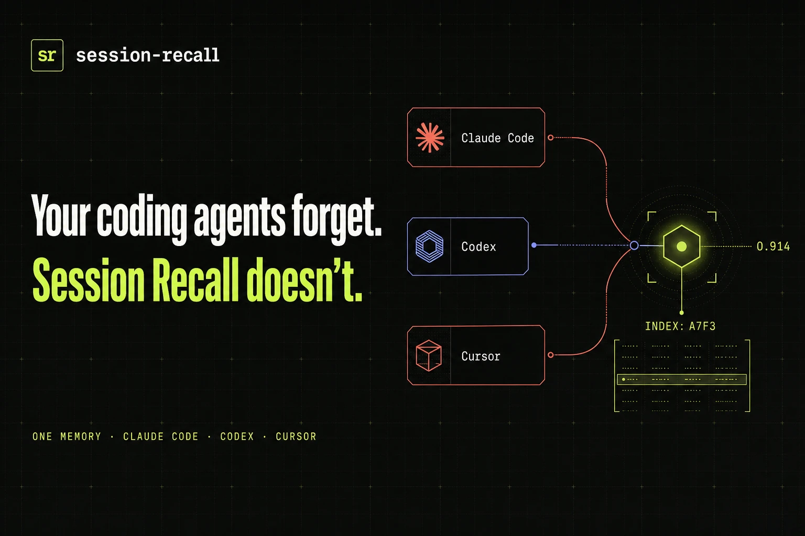
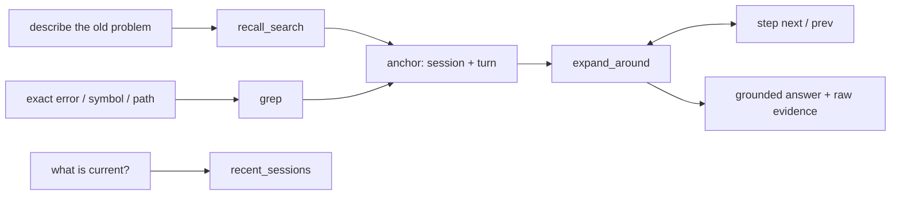
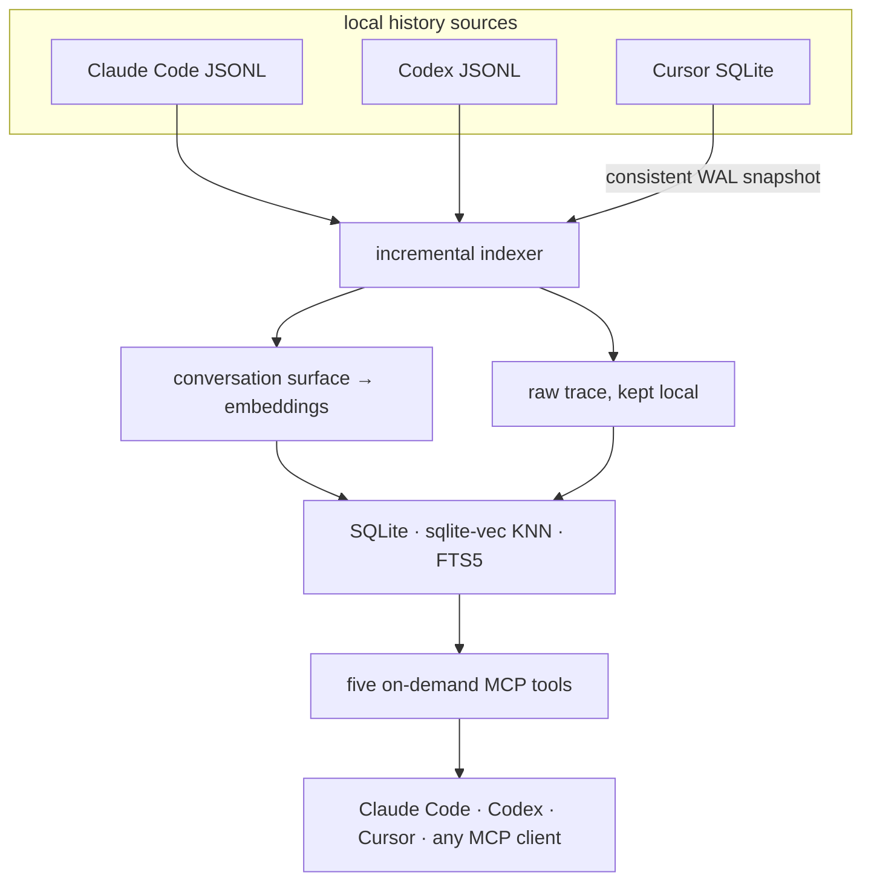

<div align="center">

<a href="#快速开始">
  
</a>

<br />
<br />

<strong>Claude Code、Codex 与 Cursor 的共享语义记忆。</strong><br />
按语义找回旧日决策。打开原始证据。继续当时的工作。

<br />
<br />

[](LICENSE)
[](pyproject.toml)
[](src/session_recall/server.py)
[](https://github.com/AbsoluteMode/session-recall/actions/workflows/test.yml)

<br />

[English](README.md) · [Русский](docs/README.ru.md) · [Español](README.es-ES.md) · 中文

*英文版为基准版本，翻译可能滞后。*

</div>

---

你的编码智能体只记得当前这场对话，而你的工作散落在数月的对话之中——
被恢复的会话、并行的订阅、多个 worktree、不同的智能体。

Session Recall 把这些历史汇成一个本地优先的索引，再通过五个专注的 MCP 工具提供出来。
新会话可以找回 Codex 昨天想通的方案、Claude Code 三个月前否掉的思路——并附上指回
真实对话轮次、工具输出与推理过程的链接。它不是谁手工维护的摘要文件：
原始对话始终是事实来源。

> **你：** 我们之前在修两个服务之间的认证令牌冲突——最后是怎么定的？
>
> **智能体：** *(recall_search → expand_around)* 两个服务共用同一个 OAuth 账号，而提供方按
> 账号轮换刷新令牌，因此任何一方刷新都会让另一方的副本失效。你否掉了共享凭据目录的补丁，
> 认为耦合太重，最终定下由一个 keeper 服务独占该会话。规格说明一直没写——那正是下一步。

## 你会得到什么

| | 能力 | 带来的改变 |
|---|---|---|
| **同一份记忆** | Claude Code、Codex 和 Cursor 写入同一个索引 | 切换智能体时无需从头重述项目脉络 |
| **语义检索** | 按语义搜索，而不只是精确字词 | 找回那些你能描述却无法逐字引用的决策 |
| **深度导航** | 打开原始轮次：工具调用、输出、推理过程 | 亲自核实答案，而不是轻信摘要 |
| **诚实降级** | 语义搜索失效时会被明确报告 | 纯字面回退绝不冒充语义搜索 |
| **默认本地** | 内置 ONNX 嵌入与本地 SQLite | 无需密钥、服务器或账号即可上手 |
| **按范围召回** | 按仓库、来源或本地日历日期过滤 | 把无关项目挡在答案之外 |
| **团队问答** | 询问同事的本地记忆，经所有者批准 | 分享来之不易的上下文，而不暴露原始会话 |

## 在哪些场景见效

- **会话入场。** 新会话一开始就带着上下文——无论你同时打理几份订阅、在智能体之间
  来回切换，还是回到某个“当时聊过”的任务。
- **Bug 与回归。** 动手修复之前，智能体先向历史提问：*这个 bug 以前见过吗？当时怎么修的？
  我们凭什么相信它修好了？* 复发不再像一个全新的 bug——修复也从打补丁变成对组件的深挖。
- **操作流程。** 一套流程只讲一遍——怎么读一份 trace、怎么按任务拆解 token 开销——
  之后的任何会话都能照着重演，无需再被手把手带一遍。
- **因果关系。** 当你说“我们改掉这个决定吧”，智能体会找出当初拍板的那一刻：
  *“选 X 是为了兼容 Y——动手之前，先确认 Y 不受影响。”*

## 五个工具，一条工作流

接口刻意保持精简：

| MCP 工具 | 何时使用 |
|---|---|
| `recall_search(query)` | 你记得大意，却记不清原话 |
| `expand_around(session_id, uuid)` | 你已找到锚点，需要它周围的证据 |
| `step(session_id, uuid, direction)` | 你想看相邻的原始轮次，而不想再搜一遍 |
| `grep(pattern)` | 你手里有精确的报错、符号、路径或标识符 |
| `recent_sessions()` | 你想要最新的工作——以及索引的新鲜度 |



每个检索工具都接受可选的 `source`（`claude` | `codex` | `cursor`）、把结果收窄到当前仓库的
`scope_cwd`（worktree 会折叠到仓库根目录），以及本地日历日期（`on_date`，或
`start_date` / `end_date`，外加 IANA `timezone`）。排好序的锚点自带出处与人类可读的时间戳。
`grep` 按需扫描**所有**已索引的会话记录——包括那些从未成为搜索分块的幕后轮次
（工具输出、思考过程）。一切只按需进行：不会向每条提示词主动注入上下文。

<details>
<summary><strong>查看一次完整调用</strong></summary>

```json
{
  "query": "why did refresh tokens conflict?",
  "scope_cwd": "/work/keeper",
  "source": "codex",
  "start_date": "2026-05-01",
  "end_date": "2026-06-30",
  "timezone": "Europe/Moscow"
}
```

`recall_search` 的应答形如 `{"anchors": [...], "degraded": null | "reason"}`。当 `degraded`
被置位时，说明嵌入提供方不可达、只运行了字面匹配——智能体可以如实说明这一点，
而不是把一次词面未命中误当作历史为空。

</details>

## 快速开始

一共两件东西：一个 Python CLI（同时附带 MCP 服务器），以及把它接进智能体的插件。
预留大约两分钟，外加首次索引运行的时间。

### 1. 安装 CLI 并构建索引

```bash
pipx install git+https://github.com/AbsoluteMode/session-recall
session-recall setup   # one question (interaction language), then the first index
```

无需密钥：在什么都不配置的情况下，索引由内置的 CPU 模型完成，模型只下载一次，
并按你的交互语言选定。首次运行会走完你的全部历史——数月的会话记录需要几分钟，
之后每次只要几秒。脚本化安装：`session-recall setup --lang en --yes`。

```console
$ session-recall index
indexed 2175 chunks from changed transcripts

your history: 1053 sessions spanning 168 days, 40,037 searchable fragments
  Claude Code 372 · Codex 680 · Cursor 1
  busiest: sidekey, trend_detection, glitch
```

托管的 Voyage 嵌入在排序上明显优于内置模型；要使用它，请在索引前导出
`VOYAGE_API_KEY`——参见[嵌入提供方](#嵌入提供方)。

### 2. 接入你的智能体

`pipx` 会把 `session-recall` 和 `session-recall-mcp` 放到 `~/.local/bin`——插件清单
正是在那里查找它们。

<details open>
<summary><strong>Claude Code</strong></summary>

```text
/plugin marketplace add AbsoluteMode/session-recall
/plugin install session-recall
```

然后开启一个新会话——MCP 服务器、技能和 SessionStart 钩子在会话启动时加载，
而不是安装时。想让智能体替你把事办完？对它说 `set up session-recall`
（或运行 `/session-recall:setup`）：它会在对话中问完引导问题、自己执行命令，
最后以一次健康检查和一次针对你真实历史的搜索收尾。

</details>

<details>
<summary><strong>Codex</strong></summary>

仓库自带原生的 [`.codex-plugin/plugin.json`](.codex-plugin/plugin.json)——可直接放进
本地仓库或你的个人 marketplace；参见
[本地插件安装指南](https://learn.chatgpt.com/docs/build-plugins#install-a-local-plugin-manually)。
Codex 还会要求你通过 `/hooks` 对新安装的钩子审查一次。

</details>

<details>
<summary><strong>Cursor</strong></summary>

需要 Cursor 2.5+（插件正是在该版本引入的）。把本仓库添加为 marketplace：

```bash
cursor-agent plugin marketplace add https://github.com/AbsoluteMode/session-recall.git
```

然后在 Cursor Agent 里输入 `/add-plugin session-recall`，并对本地 stdio MCP 服务器
批准一次，工具即可启动。若要做插件开发，请用
`cursor-agent --plugin-dir /absolute/path/to/session-recall` 启动，而不是安装缓存副本。

Cursor 会按其 macOS/Linux 常规数据路径被自动检测，且无需处于运行状态。
便携版或自定义配置目录？用
`SESSION_RECALL_CURSOR_DB=/path/to/User/globalStorage/state.vscdb` 直接指向数据库。

</details>

### 3. 验证是否生效

```bash
session-recall search "something you actually discussed last week"
```

结果带有 `score` 就说明语义搜索已生效。在智能体里，`claude mcp list` 应显示
`session-recall ✔ Connected`，而询问过去的工作应触发 `recall_search`。再无其他要配置的：
每个插件都自带其宿主的启动钩子并在后台重新索引，共享索引会自行跟上三份历史的进度。

## 工作原理



只有对话的“表层”会被嵌入——用户提示词与助手的文字回复。工具调用、结果、推理过程
及其他追踪数据绝不会发送给嵌入提供方，但始终可以通过 `expand_around`、`step` 和 `grep`
按需取到。Claude 的 sidechain 与派生子智能体的会话被有意跳过：那是幕后的工具活动，
不是对话。

Cursor 的数据经 online backup API 从其 SQLite 存储读取，因此活动中的 WAL 数据库也能
被一致地捕获，且不阻塞编辑器。其 bubble 会被规范化为数据目录下持久、按内容寻址的
JSONL 快照——即使 Cursor 关闭、升级或被卸载，深度导航依然可用。

索引是增量式的，对活跃会话记录开销很小：它们只会追加，未变化的分块按内容哈希匹配
并复用已有向量——只有新轮次才会触达嵌入提供方。把 Codex rollout 移入归档同样复用
其向量。每个文件在自己的事务中完成索引；失败的文件会被记录并在下次运行时重试，
绝不拖垮其余文件。

## CLI 速查表

```bash
# Refresh every history, or one source
session-recall index
session-recall index --source cursor

# Semantic search — unified by default, scopable to a repo
session-recall search "why did we choose the keeper service?"
session-recall search "deployment work" --source codex --scope /work/keeper

# Local calendar dates, any IANA timezone (defaults to this computer's)
session-recall recent --date 2026-07-14
session-recall search "deployment work" \
  --start-date 2026-07-14 --end-date 2026-07-16 \
  --timezone Asia/Yekaterinburg

# Exact raw scan — no embedding call, caps at 100 matches by default
session-recall grep "invalid_grant" --limit 100

# Housekeeping
session-recall prune    # drop rows for transcripts deleted from disk
session-recall health   # the whole chain, verdict GREEN/AMBER/RED
```

`search`、`recent`、`grep` 和 `prune` 都接受 `--source claude|codex|cursor`；省略即为
统一历史。日期过滤是闭区间，两端边界均可省略。

## 嵌入提供方

不锁定任何单一供应商。`SESSION_RECALL_EMBED=<preset>` 会把端点、模型、维度和重排序器
一并设定，因为这四项并不是相互独立的选择：

| 预设 | 运行方式 | 模型 | 维度 | 重排序器 |
|---|---|---|---:|---|
| `builtin-en` | **内置，免费** | `bge-small-en-v1.5` | 384 | — |
| `builtin-zh` | **内置，免费** | `bge-small-zh-v1.5` | 512 | — |
| `builtin-multi` | **内置，免费** | `paraphrase-multilingual-MiniLM-L12-v2` | 384 | — |
| `ollama` | **本地，免费** | `nomic-embed-text` | 768 | — |
| `lmstudio` | **本地，免费** | `nomic-embed-text-v1.5` | 768 | — |
| `voyage` | 托管，需要密钥 | `voyage-4-large` | 1024 | `rerank-2.5` |
| `openai` | 托管，需要密钥 | `text-embedding-3-large` | 1024 | — |

未设置预设时，Session Recall 的取舍顺序是：存在 `VOYAGE_API_KEY` 时选 Voyage，
其次探测已在监听的本地服务器，否则运行内置 ONNX 模型——开箱即用永远成立。
内置模型的具体选型跟随你在引导时选定的交互语言（`SESSION_RECALL_LANG=en|zh|…`：
英文或中文各有小型专用模型，其余语言用多语言模型）。首次使用会把模型一次性下载到
数据目录（70–240 MB），此后始终在 CPU 上推理。其排序明显粗于托管的 Voyage——
是起点，不是上限。本地预设不带重排序器，因此排序只靠 KNN + FTS。

**从头到尾免费且本地：**

```bash
ollama pull nomic-embed-text
export SESSION_RECALL_EMBED=ollama
session-recall index
```

**你自己的端点**——任何实现 `/v1/embeddings` 的服务器（llama.cpp、vLLM、公司网关）。
单项变量永远优先于预设，可以放心混搭：

```bash
export SESSION_RECALL_EMBED_PROVIDER=openai-compatible
export SESSION_RECALL_EMBED_BASE_URL=https://embeddings.internal/v1
export SESSION_RECALL_EMBED_MODEL=your-model
export SESSION_RECALL_EMBED_DIM=1024
```

**换嵌入器就得换索引。** 向量表是定宽的，因此更换模型或维度意味着重建：删除
`~/.local/share/session-recall/index.db` 并重新运行 `index`。Session Recall 会为每个
已索引文件记录嵌入空间指纹，并拒绝混用不同空间——语义搜索会带着明确的提示直接关闭，
而不是返回具有误导性的排序。

<details>
<summary><strong>模型许可说明</strong></summary>

`nomic-embed-text` 之所以是本地默认，是因为它采用 Apache-2.0 许可证，而且一条命令
就能装好。更强的小模型确实存在——`jina-embeddings-v5-text-nano` 以其体量而言得分
高得多——但它们采用 **CC BY-NC** 许可证，任何拿它索引工作历史的人都在无人提醒的
情况下违反条款。如果你的用途确属非商业，可把上面的变量指向这类模型。如果你的工作
不止用英语，`qwen3-embedding:0.6b`（Apache-2.0）处理多语言历史的能力远胜 `nomic`。

</details>

## 保持索引新鲜

如果你安装了插件，这一步已经自动处理：内置的 `SessionStart` 钩子会在每次会话启动时
于后台运行 `session-recall index`，而增量索引让这份开销一直很低。

<details>
<summary><strong>手动注册了 MCP 服务器？自己补上钩子</strong></summary>

在 `~/.claude/settings.json` 中：

```json
"hooks": {
  "SessionStart": [
    { "hooks": [ {
      "type": "command",
      "command": "sr=/abs/path/.venv/bin/session-recall; pgrep -f \"$sr index\" >/dev/null 2>&1 || (VOYAGE_API_KEY=... \"$sr\" index >/tmp/sr-index.log 2>&1 &)"
    } ] }
  ]
}
```

`pgrep` 守卫可防止重复运行；`( … & )` 让进程脱离，会话启动无需等待。宿主层面的钩子
请保持同步——shell 已经把索引器放到了后台，而且 Codex 会忽略 Claude 的 `async` 扩展。
用 `launchd`/cron 定时器也可以。

</details>

## 团队模式——询问同事的历史

同样的召回能力，跨越机器：与同事配对一次，你的智能体就能向对方的智能体询问
他们过去的工作。

> **你 → 同事的智能体：** 你们当时碰到 X 的本地启动问题——是怎么解决的？
>
> **对方的智能体** *（在同事批准答案之后）*：把配置固定到……，接着……，
> 问题从此不再复现。

过去需要一串 Slack 消息加一段记忆模糊的解释，如今变成一个问题和一个有据可依的答案。
你永远看不到同事的原始历史——只能看到他们批准的那个答案。

这里的隐私靠机制保障，而不是靠政策承诺：

- 问题与答案以**端到端加密的信封**传输；中继存储的只是它自己也无法读取的盲 blob；
- 答案由**隔离的只读 worker** 构建，范围仅限该联系人被明确授权的项目（`share allow`）；
- 每个候选答案在离开机器之前，都要先过**机密扫描器**，再经**所有者的明确批准**
  （Telegram 机器人，或本地执行 `share approve`）；
- 联系人可以随时暂停（`share pause`），对等方可以随时吊销（`share revoke`）。

搜索对等方的索引不需要你这边配置任何嵌入：查询以纯文本传输，由所有者的 worker
用他们自己的提供方、对着他们自己的索引完成嵌入。

<details>
<summary><strong>选择传输方式（配对前，一次即可）</strong></summary>

全新安装**不带任何传输方式**，绝不会连接你未选择的服务器。中继是盲的——它承载的
一切都在客户端完成密封和签名——所以选哪种传输只是对等双方之间的协调问题，
而非信任问题。

**共享文件夹——零基础设施。** 一台机器上的两个账户，或任何双方都在同步的文件夹
（Syncthing、Dropbox、NFS 挂载）：

```bash
export SESSION_RECALL_SHARE_TRANSPORT_DIR=~/Sync/sr-share   # both peers, same folder
```

**局域网内自建中继。** 一台机器运行中继，其余机器都指向它。信封无论如何都是端到端
加密的，但这毕竟是明文 HTTP——请限制在你信任的网络内：

```bash
session-recall share relay --port 8787 --host 0.0.0.0       # on the relay machine
export SESSION_RECALL_RELAY_URL=http://192.168.1.20:8787    # on every peer
```

**公网上自建中继。** 中继刻意只绑定 localhost，并期望前面有一个 TLS 终结器
（Caddy 是两行配置就能搞定的选项）：

```bash
session-recall share relay --port 8787    # binds 127.0.0.1
```

```text
relay.example.com {
    reverse_proxy 127.0.0.1:8787
}
```

然后在每个对等方上执行：`export SESSION_RECALL_RELAY_URL=https://relay.example.com`。
中继只存储密封后的 blob，且邮箱在取件时即被清空。`SESSION_RECALL_RELAY_URL=none`
可让一套安装刻意保持网络静默。把这条 `export` 写进你的 shell 配置文件，
让智能体和定时器也能读到它。

</details>

<details>
<summary><strong>配对与提问</strong></summary>

配对是一次性的仪式，附带一个简短的 SAS 校验，之后提问只需一条命令：

```bash
session-recall share init            # once per device, both sides
session-recall share invite          # you: prints a one-time code
session-recall share join <code>     # colleague: accepts it
session-recall share complete        # you: finish the handshake
session-recall share trust <name>    # both: confirm the SAS matched, name the peer
session-recall share allow <name> <project>
session-recall share notify          # owner side: worker + approval loop

session-recall share ask <name> "how did you fix the local X launch?"
session-recall share fetch           # collect the answers
```

</details>

## Meta docs——写下来的项目记忆

原始召回回答的是*当时说了什么*。Meta docs 回答的是智能体在任务中途真正会问的问题：
*这个 bug 以前修过吗？这个操作怎么做？当初为什么这么定？* 一个每日任务会把每个会话的
对话内容——用户消息和最终回答，绝不含工具噪音——交给一个蒸馏智能体，由它在你指定的
Git 仓库里维护 Markdown 条目：

- `<project>/bugs/`——确实修复过的 bug：每个 bug 如何被识别、诊断、修复，
  以及如何证明已修复；
- `<project>/actions/`——按步骤写下的操作流程，再次被问到的智能体只凭条目本身
  就能照做；
- `<project>/decisions/`——有过争议的选择：定了什么、为何这样定、否掉了什么；
- `USER/`——一张全局地图，记录你的信息存放在哪里以及*如何找到它*（查询命令与
  存储位置——绝不记录存储的值本身）。

```bash
session-recall metadocs init ~/meta-docs --from-today   # memory starts now
session-recall metadocs run                             # one pass now
session-recall metadocs enable   # daily job: launchd (macOS) / systemd user timer (Linux)
session-recall metadocs status
session-recall metadocs index-history --days 30         # opt-in: distill the past, once
```

蒸馏器的全部世界只有四个 MCP 动词——`search / create / edit / delete`——而那些承重的
规则是服务器机制，不是提示词请求：智能体没先 `search` 就调用 `create` 会被拒绝
（去重是强制的），条目在任何字节落盘之前都会先做机密扫描，`delete` 必须给出理由。
运行是增量式的，每个有变更的项目都会得到自己的本地提交——审阅就是看 diff，撤销就是
revert，与团队共享这份记忆只需把仓库推到某个私有位置。除非你主动选择 `--push`，
否则什么都不会被推送；引擎和模型只来自配置（`init --engine claude-cli|codex --model …`）——
没有任何东西被悄悄选定。

## 隐私是硬性不变量

这是一个公开仓库，**里面只有代码**。运行时数据位于 `~/.local/share/session-recall/`，
在仓库目录树之外——物理上就无法被提交。

| 留在你的机器上 | 只有你主动选择才会离开 |
|---|---|
| Claude Code 与 Codex 的原始会话记录 | 对话表层文本 → 你配置的托管嵌入器 |
| Cursor 的 SQLite 存储及其规范化快照 | 一条经明确批准的团队模式答案 |
| 工具调用、输出、推理过程——完整的原始追踪 | 走内置/本地嵌入路径时——什么都不会离开 |
| SQLite 索引与已存储的向量 | |

- API 密钥只以环境变量形式存在；`.gitignore` 拦截 `.env`。
- 测试使用合成夹具，绝不使用真实会话的片段。
- 内置提供方让整条索引链路都留在设备上。如果你选择托管提供方，请选一个你放心
  托付会话记录表层文本的。

## 故障排查

从这里开始——它会检查整条链路，并在确实出问题时以非零码退出，因此也适合放进定时器：

```console
$ session-recall health
[ok  ] Freshness  2 minutes behind
[warn] Embedder   responded in 5828 ms
                  → slow provider will make indexing crawl
[ok  ] Vector space  builtin/BAAI/bge-small-en-v1.5/384
[ok  ] Corpus     1054 sessions (claude 373, codex 680, cursor 1)
[ok  ] Sources    claude, codex, cursor present

verdict: AMBER (voyage/voyage-4-large, index at ~/.local/share/session-recall/index.db)
```

Freshness 比较的是磁盘上最新的会话记录与索引中最新的轮次，因此一个每次会话都运行
却每次都失败的索引器仍会显示为落后——这正是那类否则完全不可见的故障。

| 症状 | 原因 / 下一步 |
|---|---|
| `recall_search` 的应答中 `degraded` 被置位 | 嵌入提供方不可达——只运行了字面匹配。结果是真实的，但未命中不能说明任何问题。 |
| `degraded` 提示 “embedder changed” | 索引构建于另一个嵌入空间。运行 `session-recall index` 重新嵌入；在那之前语义排序保持关闭——这是有意为之。 |
| 索引器日志出现带 HTML 响应体的 `HTTP code 403` | 不是你的密钥的问题：是 WAF 在拦截你的 IP（VPN 和数据中心出口很常见）。完全不带密钥时也会出现同样的 403。把出口流量改道别处，或更换提供方。 |
| `Missing dependencies for SOCKS support` | 环境中设置了 SOCKS 代理，但该 venv 里没有安装 `PySocks`。 |
| `recent_sessions` 显示的时间戳很旧 | 索引器最近没有成功运行过。手动运行 `session-recall index` 并阅读输出。 |
| Cursor 使用自定义配置目录 | 设置 `SESSION_RECALL_CURSOR_DB=/path/to/User/globalStorage/state.vscdb`。 |

## 开发

```bash
git clone https://github.com/AbsoluteMode/session-recall.git
cd session-recall
python -m venv .venv
.venv/bin/pip install -e ".[dev]"
.venv/bin/pytest -q
```

不用插件、改为手动注册 MCP 服务器：

```bash
claude mcp add session-recall --scope user -- /absolute/path/.venv/bin/session-recall-mcp
```

工程决策依据与不变量记录在 [`docs/decisions/`](docs/decisions/) 中。建议从这些读起：

- [统一的 Claude Code + Codex 索引](docs/decisions/2026-07-10-unified-claude-codex-index.md)
- [Cursor 作为持久的原始数据源](docs/decisions/2026-08-03-cursor-durable-raw-source.md)
- [按项目范围的召回](docs/decisions/2026-06-26-recall-project-scope.md)
- [P2P 分享的安全门禁](docs/decisions/2026-07-30-p2p-sharing-v1-security-gate.md)
- [Meta docs——活的项目记忆](docs/decisions/2026-07-31-metadocs-living-project-memory.md)

## 路线图

- **托管/团队索引**——为团队提供一个共享索引，而不是每台机器各存一份。坦率的
  未解问题：谁搜索谁就得嵌入查询，因此共享向量空间意味着共享嵌入链路。
- **按联系人绕过审批**——对你完全信任的对等方跳过逐条答案审批；目前每个答案
  都需要明确批准。
- **更多历史来源**——Claude Code、Codex 和 Cursor 之外其他智能体的会话记录。

## 参与贡献

欢迎提交 issue、改进文档、编写宿主适配器和翻译。夹具请保持合成数据，绝不要提交
真实的会话记录、索引、嵌入或凭据。

<div align="center">
  <br />
  <strong>别再重建上下文。延续它。</strong>
  <br />
  <br />
  <a href="#快速开始">立即开始</a>
  &nbsp;·&nbsp;
  <a href="LICENSE">MIT 许可证</a>
</div>
