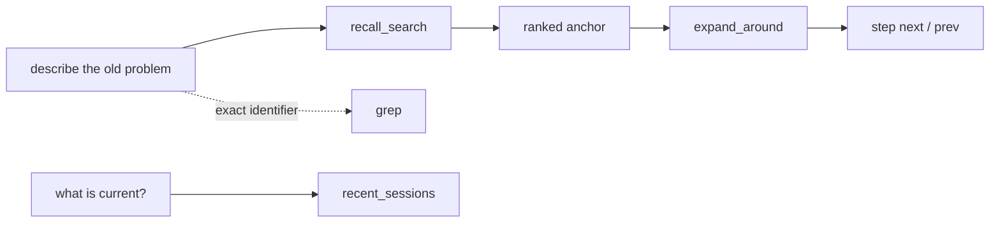
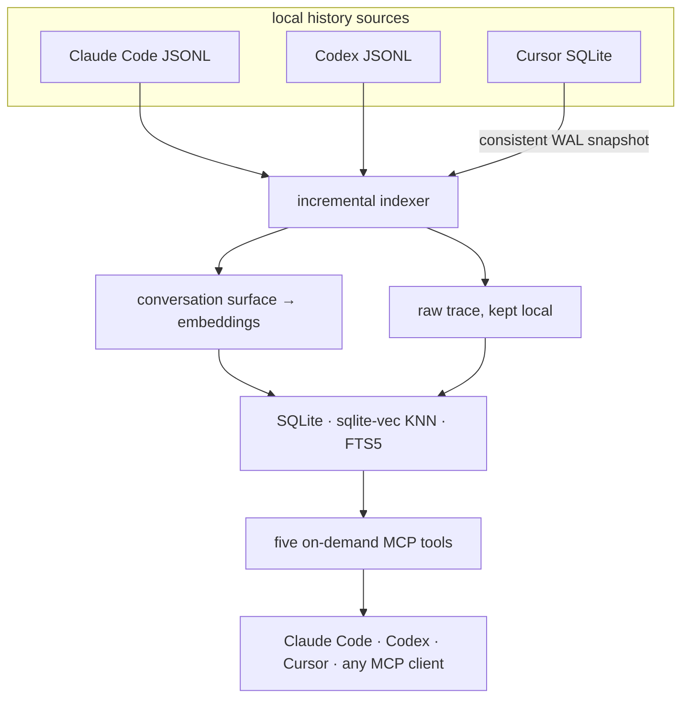

<div align="center">

<a href="#быстрый-старт">
  
</a>

<br />
<br />

<strong>Общая семантическая память для Claude Code, Codex и Cursor.</strong><br />
Найди старое решение по смыслу. Открой сырые доказательства. Продолжи работу.

<br />
<br />

[](../LICENSE)
[](../pyproject.toml)
[](../src/session_recall/server.py)
[](https://github.com/AbsoluteMode/session-recall/actions/workflows/test.yml)

<br />

[English](../README.md) · Русский · [Español](../README.es-ES.md) · [中文](../README.zh-CN.md)

*Эталонная версия — английская; переводы могут отставать.*

</div>

---

Кодинг-агенты помнят текущий чат. А работа живёт в месяцах чатов — возобновлённые сессии,
параллельные подписки, worktree, разные агенты.

Session Recall превращает эту историю в единый local-first индекс и отдаёт её обратно через
пять узких MCP-инструментов. Свежая сессия может восстановить то, что вчера придумал Codex,
и то, что Claude Code отверг три месяца назад — со ссылками на реальные реплики, вывод
инструментов и рассуждения. Это не summary-файл, который кто-то ведёт руками: источником
истины остаётся сам разговор.

> **вы:** мы чинили конфликт auth-токенов между двумя сервисами — на чём остановились?
>
> **агент:** *(recall_search → expand_around)* Оба сервиса сидели на одном OAuth-аккаунте, а
> провайдер ротирует refresh-токены на уровне аккаунта, поэтому каждый refresh инвалидировал
> копию соседа. Патч с общей директорией кредов вы отвергли — слишком жёсткая связка — и
> остановились на keeper-сервисе, который владеет сессией. Спека так и не была написана —
> это и был следующий шаг.

## Что это даёт

| | Возможность | Что это меняет |
|---|---|---|
| **Одна память** | Claude Code, Codex и Cursor пополняют один индекс | Смена агента не сбрасывает историю проекта |
| **Семантический поиск** | Поиск по смыслу, а не только по точным словам | Находятся решения, которые описать можно, а процитировать — нет |
| **Глубокая навигация** | Открываются сырые реплики: вызовы инструментов, вывод, рассуждения | Ответ можно проверить, а не верить пересказу |
| **Честная деградация** | Отказ семантики репортится явно | Буквальный fallback никогда не притворяется семантическим поиском |
| **Локальность по умолчанию** | Встроенные ONNX-эмбеддинги и локальный SQLite | Старт без ключа, сервера и аккаунта |
| **Recall со скоупом** | Фильтры по репозиторию, источнику и локальным календарным датам | Посторонние проекты не попадают в ответ |
| **Командные ответы** | Вопрос к локальной памяти коллеги — с его одобрения | Выстраданный контекст передаётся без раскрытия сырых сессий |

## Где это окупается

- **Онбординг сессии.** Свежая сессия стартует уже в контексте — и при нескольких
  параллельных подписках, и при прыжках между агентами, и при возврате к задаче, которую
  «когда-то обсуждали».
- **Баги и регрессии.** Прежде чем что-то чинить, агент спрашивает историю: *был ли уже этот
  баг? как его чинили? почему поверили, что починили?* Рецидив перестаёт выглядеть свежим
  багом — а фикс превращается из заплатки в раскопки внутри компонента.
- **Процедуры.** Достаточно один раз объяснить процесс — как читать трейс, как разложить
  расход токенов по задаче — и любая следующая сессия воспроизведёт его без повторного
  инструктажа.
- **Причинно-следственные связи.** Стоит сказать «давай изменим это решение» — и агент
  поднимет момент, когда оно принималось: *«мы выбрали X ради совместимости с Y — прежде
  чем менять, надо убедиться, что Y это переживёт»*.

## Пять инструментов, один воркфлоу

Интерфейс намеренно остаётся маленьким:

| MCP-инструмент | Когда использовать |
|---|---|
| `recall_search(query)` | В памяти идея, а не формулировка |
| `expand_around(session_id, uuid)` | Якорь найден, нужны доказательства вокруг него |
| `step(session_id, uuid, direction)` | Нужна соседняя сырая реплика без нового поиска |
| `grep(pattern)` | Известны точная ошибка, символ, путь или идентификатор |
| `recent_sessions()` | Нужна самая свежая работа — и свежесть самого индекса |



Каждый поисковый инструмент принимает необязательный `source` (`claude` | `codex` |
`cursor`), `scope_cwd` — сузить выдачу до текущего репозитория (worktree схлопываются к
корню репо) — и локальные календарные даты (`on_date` либо `start_date` / `end_date`, плюс
`timezone` в формате IANA). Ранжированные якоря несут происхождение и человекочитаемый
таймстемп. `grep` сканирует **все** проиндексированные транскрипты по требованию — включая
подкапотные реплики (вывод инструментов, размышления), которые так и не стали поисковыми
чанками. Только по требованию: никакой проактивной инъекции контекста в каждый промпт.

<details>
<summary><strong>Посмотреть полный вызов</strong></summary>

```json
{
  "query": "why did refresh tokens conflict?",
  "scope_cwd": "/work/keeper",
  "source": "codex",
  "start_date": "2026-05-01",
  "end_date": "2026-06-30",
  "timezone": "Europe/Moscow"
}
```

`recall_search` отвечает `{"anchors": [...], "degraded": null | "reason"}`. Если `degraded`
заполнен, провайдер эмбеддингов был недоступен и отработало только буквальное совпадение —
агент может сказать об этом прямо, а не принять лексический промах за пустую историю.

</details>

## Быстрый старт

Две части: Python-CLI (он же несёт MCP-сервер) и плагин, который подключает его к агенту.
По времени — около двух минут плюс первый прогон индексации.

### 1. Установить CLI и построить индекс

```bash
pipx install git+https://github.com/AbsoluteMode/session-recall
session-recall setup   # one question (interaction language), then the first index
```

Ключ не нужен: без всякой настройки индексация идёт на встроенной CPU-модели — она
скачивается один раз и выбирается по языку общения. Первый прогон проходит всю историю
целиком: минуты на месяцы транскриптов, дальше — секунды. Скриптовая установка:
`session-recall setup --lang en --yes`.

```console
$ session-recall index
indexed 2175 chunks from changed transcripts

your history: 1053 sessions spanning 168 days, 40,037 searchable fragments
  Claude Code 372 · Codex 680 · Cursor 1
  busiest: sidekey, trend_detection, glitch
```

Облачные эмбеддинги Voyage ранжируют заметно лучше встроенной модели; чтобы включить их,
достаточно экспортировать `VOYAGE_API_KEY` до индексации — см.
[Провайдеры эмбеддингов](#провайдеры-эмбеддингов).

### 2. Подключить агентов

`pipx` кладёт `session-recall` и `session-recall-mcp` в `~/.local/bin` — ровно туда, где их
ищут манифесты плагинов.

<details open>
<summary><strong>Claude Code</strong></summary>

```text
/plugin marketplace add AbsoluteMode/session-recall
/plugin install session-recall
```

Дальше — новая сессия: MCP-серверы, скиллы и хук SessionStart подгружаются на старте
сессии, а не в момент установки. Хочется, чтобы агент довёл дело сам? Фраза
`set up session-recall` (или команда `/session-recall:setup`) — и он задаст вопросы
онбординга прямо в чате, сам выполнит команды и закончит health-проверкой и настоящим
поиском по вашей истории.

</details>

<details>
<summary><strong>Codex</strong></summary>

В репозитории лежит нативный [`.codex-plugin/plugin.json`](../.codex-plugin/plugin.json) —
готов лечь в локальное репо или личный маркетплейс; см.
[гайд по установке локального плагина](https://learn.chatgpt.com/docs/build-plugins#install-a-local-plugin-manually).
Codex также один раз попросит отревьюить свежеустановленные хуки через `/hooks`.

</details>

<details>
<summary><strong>Cursor</strong></summary>

Нужен Cursor 2.5+ (плагины появились именно там). Репозиторий подключается как маркетплейс:

```bash
cursor-agent plugin marketplace add https://github.com/AbsoluteMode/session-recall.git
```

Дальше в Cursor Agent — `/add-plugin session-recall` и одно одобрение локального stdio
MCP-сервера, чтобы инструменты могли стартовать. Для разработки плагина запускается
`cursor-agent --plugin-dir /absolute/path/to/session-recall` вместо установки кешированной
копии.

Cursor находится автоматически по стандартному пути данных macOS/Linux, и запущенным ему
быть не обязательно. Portable или кастомный профиль? База указывается напрямую:
`SESSION_RECALL_CURSOR_DB=/path/to/User/globalStorage/state.vscdb`.

</details>

### 3. Проверить, что работает

```bash
session-recall search "something you actually discussed last week"
```

Хиты со `score` означают, что семантический поиск жив. В агенте `claude mcp list` должен
показывать `session-recall ✔ Connected`, а вопрос о прошлой работе — триггерить
`recall_search`. Больше настраивать нечего: каждый плагин несёт стартовый хук своего хоста
и переиндексирует в фоне, так что общий индекс сам поспевает за всеми тремя историями.

## Как это устроено



Эмбеддится только «поверхность» разговора — промпты пользователя и текстовые ответы
ассистента. Вызовы инструментов, результаты, рассуждения и остальные данные трейса никогда
не отправляются провайдеру эмбеддингов, но остаются доступными по требованию через
`expand_around`, `step` и `grep`. Сайдчейны Claude и сессии порождённых сабагентов
пропускаются намеренно: это подкапотная механика, а не разговор.

Cursor читается из его SQLite-хранилища через online backup API, так что живая WAL-база
снимается консистентно и без блокировки редактора. Его bubbles нормализуются в долговечные
content-addressed JSONL-снапшоты в директории данных — глубокая навигация продолжает
работать после того, как Cursor закрылся, обновился или был удалён.

Индексация инкрементальная и дешёвая на живых транскриптах: они append-only, поэтому
неизменённые чанки матчатся по хешу содержимого, а их векторы переиспользуются — до
провайдера эмбеддингов доходят только новые реплики. Переезд rollout-файла Codex в архив
тоже переиспользует его векторы. Каждый файл индексируется в собственной транзакции;
сбойный файл логируется и повторяется на следующем прогоне, никогда не прерывая остальные.

## Шпаргалка по CLI

```bash
# Refresh every history, or one source
session-recall index
session-recall index --source cursor

# Semantic search — unified by default, scopable to a repo
session-recall search "why did we choose the keeper service?"
session-recall search "deployment work" --source codex --scope /work/keeper

# Local calendar dates, any IANA timezone (defaults to this computer's)
session-recall recent --date 2026-07-14
session-recall search "deployment work" \
  --start-date 2026-07-14 --end-date 2026-07-16 \
  --timezone Asia/Yekaterinburg

# Exact raw scan — no embedding call, caps at 100 matches by default
session-recall grep "invalid_grant" --limit 100

# Housekeeping
session-recall prune    # drop rows for transcripts deleted from disk
session-recall health   # the whole chain, verdict GREEN/AMBER/RED
```

`search`, `recent`, `grep` и `prune` принимают `--source claude|codex|cursor`; без него —
единая история. Фильтры дат включительные, любую из границ можно опустить.

## Провайдеры эмбеддингов

Ничего не прибито к одному вендору. `SESSION_RECALL_EMBED=<preset>` задаёт endpoint,
модель, размерность и reranker разом, потому что эти четыре параметра — не независимые
выборы:

| Пресет | Где работает | Модель | Разм. | Реранкер |
|---|---|---|---:|---|
| `builtin-en` | **в комплекте, бесплатно** | `bge-small-en-v1.5` | 384 | — |
| `builtin-zh` | **в комплекте, бесплатно** | `bge-small-zh-v1.5` | 512 | — |
| `builtin-multi` | **в комплекте, бесплатно** | `paraphrase-multilingual-MiniLM-L12-v2` | 384 | — |
| `ollama` | **локально, бесплатно** | `nomic-embed-text` | 768 | — |
| `lmstudio` | **локально, бесплатно** | `nomic-embed-text-v1.5` | 768 | — |
| `voyage` | в облаке, нужен ключ | `voyage-4-large` | 1024 | `rerank-2.5` |
| `openai` | в облаке, нужен ключ | `text-embedding-3-large` | 1024 | — |

Без пресета Session Recall берёт Voyage, когда есть `VOYAGE_API_KEY`, затем пробует найти
уже слушающий локальный сервер, а иначе запускает встроенную ONNX-модель — из коробки
работает всегда. Встроенный вариант следует за языком общения, выбранным на онбординге
(`SESSION_RECALL_LANG=en|zh|…`: маленький специалист по английскому или китайскому, иначе —
мультиязычная модель). Первое использование один раз скачивает модель в директорию данных
(70–240 МБ), дальше — CPU-инференс. Ранжирование заметно грубее облачного Voyage — это
стартовая точка, а не потолок. Локальные пресеты идут без реранкера, так что ранжирование —
только KNN + FTS.

**Бесплатно и локально, от начала до конца:**

```bash
ollama pull nomic-embed-text
export SESSION_RECALL_EMBED=ollama
session-recall index
```

**Свой endpoint** — любой сервер, говорящий на `/v1/embeddings` (llama.cpp, vLLM,
корпоративный gateway). Отдельные переменные всегда бьют пресет, так что их можно свободно
смешивать:

```bash
export SESSION_RECALL_EMBED_PROVIDER=openai-compatible
export SESSION_RECALL_EMBED_BASE_URL=https://embeddings.internal/v1
export SESSION_RECALL_EMBED_MODEL=your-model
export SESSION_RECALL_EMBED_DIM=1024
```

**Другому эмбеддеру нужен свой индекс.** Векторные таблицы фиксированной ширины, поэтому
смена модели или размерности означает пересборку: удалить
`~/.local/share/session-recall/index.db` и заново прогнать `index`. Session Recall снимает
отпечаток пространства эмбеддингов у каждого проиндексированного файла и отказывается
смешивать пространства — семантический поиск выключается с явным сообщением, вместо того
чтобы возвращать обманчивое ранжирование.

<details>
<summary><strong>Заметки о лицензиях моделей</strong></summary>

`nomic-embed-text` — локальный дефолт, потому что он под Apache-2.0 и ставится одной
командой. Есть маленькие модели и сильнее — `jina-embeddings-v5-text-nano` для своего
размера набирает куда больше, — но они **CC BY-NC**: индексируя рабочую историю, такую
лицензию нарушал бы каждый, и никто бы ему об этом не сказал. Если использование
действительно некоммерческое — можно направить переменные выше на такую модель. Если
история не только на английском, `qwen3-embedding:0.6b` (Apache-2.0) справляется с
мультиязычностью куда лучше `nomic`.

</details>

## Как индекс остаётся свежим

Если установлен плагин, это уже решено: встроенный хук `SessionStart` запускает
`session-recall index` в фоне на каждом старте сессии, а инкрементальная индексация делает
это дёшево.

<details>
<summary><strong>MCP-сервер зарегистрирован вручную? Хук добавляется так</strong></summary>

В `~/.claude/settings.json`:

```json
"hooks": {
  "SessionStart": [
    { "hooks": [ {
      "type": "command",
      "command": "sr=/abs/path/.venv/bin/session-recall; pgrep -f \"$sr index\" >/dev/null 2>&1 || (VOYAGE_API_KEY=... \"$sr\" index >/tmp/sr-index.log 2>&1 &)"
    } ] }
  ]
}
```

Гард на `pgrep` не даёт прогонам накладываться; `( … & )` отцепляет процесс, чтобы старт
сессии не ждал. Хук на уровне хоста должен оставаться синхронным — шелл и так уводит
индексер в фон, а Codex игнорирует Claude-расширение `async`. Таймер `launchd`/cron тоже
подходит.

</details>

## Командный режим — спросить историю коллеги

Тот же recall, но между машинами: один раз создать пару с коллегой — и ваш агент сможет
спрашивать его агента о его прошлой работе.

> **вы → агенту коллеги:** когда ты столкнулся с проблемой локального запуска X — как ты её
> решил?
>
> **его агент** *(после того как коллега одобрил ответ)*: закрепи конфиг на …, затем … — и
> проблема больше не возвращается.

То, что раньше было тредом в Slack и полузабытым объяснением, становится одним вопросом и
одним обоснованным ответом. Сырую историю коллеги вы не видите никогда — только ответ,
который он одобрил.

Приватность здесь — механика, а не политика:

- вопросы и ответы ездят **end-to-end зашифрованными конвертами**; relay хранит слепые
  блобы, прочитать которые не может;
- ответы собирает **изолированный read-only воркер**, ограниченный проектами, которые этому
  контакту явно выдали (`share allow`);
- каждый кандидат в ответ проходит **сканер секретов**, а затем **явное одобрение
  владельца** (Telegram-бот или локально `share approve`), прежде чем покинуть машину;
- контакт можно в любой момент поставить на паузу (`share pause`), пира — отозвать
  (`share revoke`).

Поиск по индексу пира не требует настройки эмбеддингов на вашей стороне: запрос едет
текстом, а воркер владельца эмбеддит его своим провайдером по своему индексу.

<details>
<summary><strong>Выбрать транспорт (один раз, до пейринга)</strong></summary>

У свежей установки **нет транспорта**, и она никогда не ходит на сервер, который вы не
выбирали. Relay слепой — всё, что он переносит, запечатано и подписано на клиентах, — так
что выбор транспорта — это координация между пирами, а не вопрос доверия.

**Общая папка — ноль инфраструктуры.** Два аккаунта на одной машине или любая папка,
которую синхронизируют оба пира (Syncthing, Dropbox, NFS-маунт):

```bash
export SESSION_RECALL_SHARE_TRANSPORT_DIR=~/Sync/sr-share   # both peers, same folder
```

**Свой relay в LAN.** Одна машина его запускает, все остальные на него смотрят. Конверты в
любом случае зашифрованы end-to-end, но это голый HTTP — пускать его стоит только в сеть,
которой вы доверяете:

```bash
session-recall share relay --port 8787 --host 0.0.0.0       # on the relay machine
export SESSION_RECALL_RELAY_URL=http://192.168.1.20:8787    # on every peer
```

**Свой relay в интернете.** Relay нарочно биндится на localhost и ждёт перед собой
TLS-терминатор (Caddy — вариант в две строки):

```bash
session-recall share relay --port 8787    # binds 127.0.0.1
```

```text
relay.example.com {
    reverse_proxy 127.0.0.1:8787
}
```

Затем на каждом пире: `export SESSION_RECALL_RELAY_URL=https://relay.example.com`. Relay
хранит только запечатанные блобы, а mailbox опустошается при fetch.
`SESSION_RECALL_RELAY_URL=none` намеренно держит установку в сетевом молчании. `export`
стоит положить в профиль шелла, чтобы агенты и таймеры тоже его видели.

</details>

<details>
<summary><strong>Пейринг и вопросы</strong></summary>

Пейринг — одноразовая церемония с короткой SAS-проверкой, дальше вопрос — одна команда:

```bash
session-recall share init            # once per device, both sides
session-recall share invite          # you: prints a one-time code
session-recall share join <code>     # colleague: accepts it
session-recall share complete        # you: finish the handshake
session-recall share trust <name>    # both: confirm the SAS matched, name the peer
session-recall share allow <name> <project>
session-recall share notify          # owner side: worker + approval loop

session-recall share ask <name> "how did you fix the local X launch?"
session-recall share fetch           # collect the answers
```

</details>

## Meta docs — память проекта, записанная текстом

Сырой recall отвечает, *что говорилось*. Meta docs отвечает на то, что агенты реально
спрашивают посреди задачи: *этот баг уже чинили? как выполнить это действие? почему решили
именно так?* Ежедневная джоба отдаёт диалог каждой сессии — сообщения пользователя и
финальные ответы, никогда шум инструментов — агенту-дистиллятору, который ведёт
Markdown-записи в выбранном Git-репозитории:

- `<project>/bugs/` — реально починенные баги: как баг распознали, как диагностировали, чем
  чинили и как доказали, что починено;
- `<project>/actions/` — процедуры, шаг за шагом, написанные так, чтобы агент, которого
  попросили снова, справился по одной записи;
- `<project>/decisions/` — спорные выборы: что решили, почему именно так и что отвергли;
- `USER/` — глобальная карта: где живёт ваша информация и *как её найти* (команды поиска и
  места хранения — никогда сами значения).

```bash
session-recall metadocs init ~/meta-docs --from-today   # memory starts now
session-recall metadocs run                             # one pass now
session-recall metadocs enable   # daily job: launchd (macOS) / systemd user timer (Linux)
session-recall metadocs status
session-recall metadocs index-history --days 30         # opt-in: distill the past, once
```

Весь мир дистиллятора — четыре MCP-глагола: `search / create / edit / delete`, а несущие
правила — это механика сервера, а не просьбы в промпте: `create` отклоняется, пока агент не
сделал `search` (дедупликация обязательна), записи сканируются на секреты до того, как хоть
байт коснётся диска, а `delete` требует причину. Прогоны инкрементальные, и каждый
изменённый проект получает свой локальный коммит — ревью это дифф, откат это revert, а
поделиться памятью с командой — значит просто запушить репо в приватное место. Ничего не
пушится без явного `--push`; движок и модель берутся только из конфига
(`init --engine claude-cli|codex --model …`) — ничего не выбирается втихую.

## Приватность — жёсткий инвариант

Это публичный репозиторий. **В него попадает только код.** Рантайм-данные живут в
`~/.local/share/session-recall/`, вне дерева репо — их физически нельзя закоммитить.

| Остаётся на вашей машине | Уходит только по вашему выбору |
|---|---|
| Оригинальные транскрипты Claude Code и Codex | Текст поверхности разговора → настроенный вами облачный эмбеддер |
| SQLite-хранилище Cursor и его нормализованные снапшоты | Явно одобренный ответ командного режима |
| Вызовы инструментов, вывод, рассуждения — весь сырой трейс | Ничего — на встроенном/локальном пути эмбеддингов |
| SQLite-индекс и сохранённые векторы | |

- API-ключи — только переменные окружения; `.gitignore` блокирует `.env`.
- Тесты используют синтетические фикстуры и никогда — реальный кусок сессии.
- Встроенный провайдер держит весь путь индексации на устройстве. Если выбран облачный —
  это должен быть тот, кому вы доверяете текст поверхности своих транскриптов.

## Диагностика

Начинать отсюда: команда проверяет всю цепочку и выходит с ненулевым кодом, когда что-то
действительно сломано, — поэтому годится и для таймера:

```console
$ session-recall health
[ok  ] Freshness  2 minutes behind
[warn] Embedder   responded in 5828 ms
                  → slow provider will make indexing crawl
[ok  ] Vector space  builtin/BAAI/bge-small-en-v1.5/384
[ok  ] Corpus     1054 sessions (claude 373, codex 680, cursor 1)
[ok  ] Sources    claude, codex, cursor present

verdict: AMBER (voyage/voyage-4-large, index at ~/.local/share/session-recall/index.db)
```

Freshness сравнивает самый свежий транскрипт на диске с самой свежей репликой в индексе,
поэтому индексер, который запускается на каждой сессии и каждый раз падает, всё равно
отображается отстающим — ровно тот сбой, который иначе невидим.

| Симптом | Причина / что делать |
|---|---|
| `recall_search` отвечает с заполненным `degraded` | Провайдер эмбеддингов недоступен — отработало только буквальное совпадение. Результаты настоящие, но промах ничего не доказывает. |
| `degraded` говорит «embedder changed» | Индекс построен в другом пространстве эмбеддингов. Прогнать `session-recall index`, чтобы переэмбеддить; до этого семантическое ранжирование выключено — намеренно. |
| Индексер логирует `HTTP code 403` с HTML-телом | Дело не в ключе: WAF режет ваш IP (типично для VPN и датацентровых выходов). Тот же 403 приходит и вовсе без ключа. Вывести трафик другим путём или сменить провайдера. |
| `Missing dependencies for SOCKS support` | В окружении задан SOCKS-прокси, а `PySocks` в этом venv не установлен. |
| `recent_sessions` показывает старый таймстемп | Индексер давно не завершался успешно. Запустить `session-recall index` руками и прочитать вывод. |
| Cursor живёт в кастомном профиле | Задать `SESSION_RECALL_CURSOR_DB=/path/to/User/globalStorage/state.vscdb`. |

## Разработка

```bash
git clone https://github.com/AbsoluteMode/session-recall.git
cd session-recall
python -m venv .venv
.venv/bin/pip install -e ".[dev]"
.venv/bin/pytest -q
```

Чтобы зарегистрировать MCP-сервер вручную, минуя плагин:

```bash
claude mcp add session-recall --scope user -- /absolute/path/.venv/bin/session-recall-mcp
```

Инженерные обоснования и инварианты живут в [`docs/decisions/`](decisions/). Начать стоит
с этих:

- [Единый индекс Claude Code + Codex](decisions/2026-07-10-unified-claude-codex-index.md)
- [Cursor как долговечный сырой источник](decisions/2026-08-03-cursor-durable-raw-source.md)
- [Recall со скоупом проекта](decisions/2026-06-26-recall-project-scope.md)
- [Security gate для P2P-шаринга](decisions/2026-07-30-p2p-sharing-v1-security-gate.md)
- [Meta docs — живая память проекта](decisions/2026-07-31-metadocs-living-project-memory.md)

## Роадмап

- **Облачный / командный индекс** — один общий индекс на команду вместо копий на каждой
  машине. Честный открытый вопрос: тот, кто ищет, должен заэмбеддить запрос, так что общее
  векторное пространство подразумевает общий путь эмбеддингов.
- **Bypass одобрения по контактам** — пропуск поштучного одобрения для полностью доверенных
  пиров; сегодня каждый ответ одобряется явно.
- **Больше историй** — транскрипты других агентов, помимо Claude Code, Codex и Cursor.

## Контрибьютинг

Issues, улучшения документации, адаптеры хостов и переводы — добро пожаловать. Фикстуры —
только синтетические; реальные транскрипты, индексы, эмбеддинги и креды не коммитятся
никогда.

<div align="center">
  <br />
  <strong>Хватит пересобирать контекст. Продолжи работу.</strong>
  <br />
  <br />
  <a href="#быстрый-старт">Начать</a>
  &nbsp;·&nbsp;
  <a href="../LICENSE">Лицензия MIT</a>
</div>
